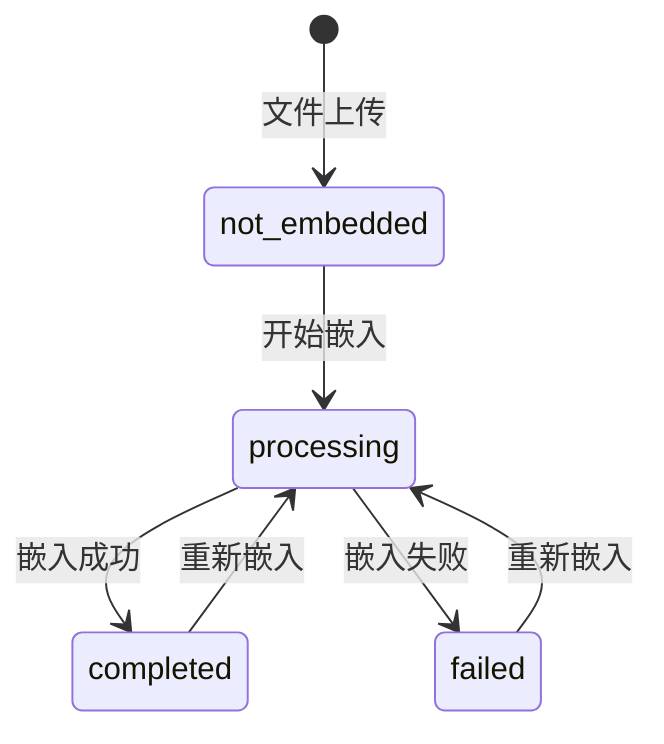

# KnowledgeFileEmbedding 表实现完成

**完成时间**: 2025-11-04  
**状态**: ✅ 已完成

---

## 问题分析

### 用户发现的问题
1. **嵌入状态追踪不完整** - 系统只在嵌入完成后才能判断状态，无法追踪"正在嵌入"的状态
2. **未使用 embedding 表** - 我们定义了 `KnowledgeFileEmbedding` 表，但向量化服务没有使用它
3. **状态查询依赖 Milvus** - 每次查询嵌入状态都要搜索 Milvus，效率低且不准确

### 正确的实现方式
- **开始嵌入** → 创建 embedding 记录 (status='processing')
- **嵌入进行中** → 可以查询 embedding 表获取状态
- **嵌入完成** → 更新 embedding 记录 (status='completed')
- **嵌入失败** → 更新 embedding 记录 (status='failed')

---

## 实现方案

### 1. 向量化服务修改

**文件**: `app/services/knowledge_base/knowledge_vectorizer_simple.py`

#### 添加导入
```python
import uuid
from datetime import datetime
from app.models import KnowledgeFileEmbedding, db
```

#### 创建/更新 embedding 记录（开始时）
```python
# 检查或创建 embedding 记录
embedding_record = KnowledgeFileEmbedding.query.filter_by(
    document_id=document.id
).first()

if embedding_record:
    # 如果正在处理，不允许重复
    if embedding_record.status == 'processing':
        return False, {'error': '文件正在向量化中，请稍后'}
    
    # 更新为处理中
    embedding_record.status = 'processing'
    embedding_record.started_at = datetime.utcnow()
    embedding_record.completed_at = None
    embedding_record.error_message = None
else:
    # 创建新的 embedding 记录
    embedding_record = KnowledgeFileEmbedding(
        id=str(uuid.uuid4()),
        document_id=document.id,
        knowledge_id=knowledge_id,
        file_path=file_path,
        status='processing',
        started_at=datetime.utcnow()
    )
    db.session.add(embedding_record)

db.session.commit()
```

#### 更新 embedding 记录（完成时）
```python
# 更新 embedding 记录为完成
embedding_record.status = 'completed'
embedding_record.completed_at = datetime.utcnow()
embedding_record.vector_count = len(chunks)
embedding_record.vector_dimension = meta_info.get('vector_dimension')
embedding_record.embedding_model = meta_info.get('model_name')
db.session.commit()
```

#### 更新 embedding 记录（失败时）
```python
# 更新 embedding 记录为失败
embedding_record.status = 'failed'
embedding_record.completed_at = datetime.utcnow()
embedding_record.error_message = str(e)
db.session.commit()
```

### 2. API 修改

**文件**: `app/api/routes/knowledge.py`

#### 修改 `get_embedding_status()` API

**之前的实现**：
- ❌ 每次都搜索 Milvus 判断状态
- ❌ 无法区分"正在嵌入"和"未嵌入"
- ❌ 性能低，响应慢

**现在的实现**：
- ✅ 查询 `knowledge_file_embeddings` 表
- ✅ 可以追踪完整生命周期：not_embedded → embedding → embedded/embedding_failed
- ✅ 高效，直接查询数据库

```python
@knowledge_bp.route('/knowledges/<string:knowledge_id>/files/embedding-status', methods=['GET'])
def get_embedding_status(knowledge_id):
    """
    获取文件嵌入状态
    
    从 knowledge_file_embeddings 表查询状态
    """
    try:
        file_path = request.args.get('file_path')
        if not file_path:
            return jsonify({
                'success': False,
                'message': '缺少 file_path 参数'
            }), 400
        
        # 修复 URL 编码问题
        file_path = fix_url_encoding(file_path)
        
        # ⭐ 查找 document 记录
        document = KnowledgeDocument.query.filter_by(
            knowledge_id=knowledge_id,
            file_path=file_path
        ).first()
        
        if not document:
            return jsonify({
                'success': True,
                'data': {
                    'status': 'not_embedded',
                    'message': '文件记录不存在'
                }
            })
        
        # ⭐ 查询 embedding 记录
        embedding = KnowledgeFileEmbedding.query.filter_by(
            document_id=document.id
        ).first()
        
        if not embedding:
            return jsonify({
                'success': True,
                'data': {
                    'status': 'not_embedded',
                    'message': '文件尚未嵌入'
                }
            })
        
        # 映射数据库状态到前端状态
        status_map = {
            'pending': 'embedding',
            'processing': 'embedding',
            'completed': 'embedded',
            'failed': 'embedding_failed'
        }
        frontend_status = status_map.get(embedding.status, 'not_embedded')
        
        return jsonify({
            'success': True,
            'data': {
                'embedding_id': embedding.id,
                'status': frontend_status,
                'db_status': embedding.status,
                'vector_count': embedding.vector_count,
                'vector_dimension': embedding.vector_dimension,
                'embedding_model': embedding.embedding_model,
                'started_at': embedding.started_at.isoformat() if embedding.started_at else None,
                'completed_at': embedding.completed_at.isoformat() if embedding.completed_at else None,
                'error_message': embedding.error_message,
                'message': f'文件{frontend_status}'
            }
        })
    
    except Exception as e:
        current_app.logger.error(f"获取嵌入状态失败: {e}")
        return jsonify({
            'success': False,
            'message': f'获取嵌入状态失败: {str(e)}'
        }), 500
```

---

## 状态流转

### 完整的嵌入生命周期



### 数据库状态

| 数据库状态 | 前端状态 | 说明 |
|-----------|---------|------|
| (无记录) | not_embedded | 文件尚未开始嵌入 |
| pending | embedding | 等待处理（预留状态） |
| processing | embedding | 正在嵌入中 |
| completed | embedded | 嵌入完成 |
| failed | embedding_failed | 嵌入失败 |

---

## 优势对比

### 之前的实现 ❌

| 方面 | 问题 |
|------|------|
| **状态追踪** | 只能判断"已嵌入"或"未嵌入"，无法知道是否正在处理 |
| **性能** | 每次查询都要搜索 Milvus，响应慢 |
| **准确性** | 依赖 Milvus 搜索结果，可能不准确 |
| **信息** | 无法获取嵌入详情（模型、维度、时间等） |
| **错误处理** | 无法记录失败原因 |

### 现在的实现 ✅

| 方面 | 优势 |
|------|------|
| **状态追踪** | 完整生命周期追踪：not_embedded → embedding → embedded/failed |
| **性能** | 直接查询数据库，响应快 |
| **准确性** | 数据库记录是唯一真实来源 |
| **信息** | 提供完整的嵌入详情（模型、维度、向量数、时间等） |
| **错误处理** | 记录详细的失败原因 |
| **防重复** | 检测到 processing 状态时拒绝重复请求 |

---

## 数据模型

### KnowledgeFileEmbedding 表结构

```python
class KnowledgeFileEmbedding(db.Model):
    __tablename__ = 'knowledge_file_embeddings'
    
    id = db.Column(db.String(36), primary_key=True)
    document_id = db.Column(db.String(36), db.ForeignKey('knowledge_documents.id', ondelete='CASCADE'), nullable=False)
    knowledge_id = db.Column(db.String(36), db.ForeignKey('knowledges.id'), nullable=False)
    file_path = db.Column(db.String(500), nullable=False)
    
    # 嵌入状态
    status = db.Column(db.String(20), nullable=False)  # pending, processing, completed, failed
    
    # 时间戳
    started_at = db.Column(db.DateTime)
    completed_at = db.Column(db.DateTime)
    
    # 嵌入信息
    vector_count = db.Column(db.Integer)  # 向量数量
    vector_dimension = db.Column(db.Integer)  # 向量维度
    embedding_model = db.Column(db.String(100))  # 使用的模型
    
    # 错误信息
    error_message = db.Column(db.Text)
```

### 字段说明

| 字段 | 类型 | 说明 | 何时更新 |
|------|------|------|----------|
| `id` | String(36) | 主键（UUID） | 创建时 |
| `document_id` | String(36) | 关联文档ID | 创建时 |
| `knowledge_id` | String(36) | 知识库ID | 创建时 |
| `file_path` | String(500) | 文件路径 | 创建时 |
| `status` | String(20) | 嵌入状态 | 开始/完成/失败时 |
| `started_at` | DateTime | 开始时间 | 开始嵌入时 |
| `completed_at` | DateTime | 完成时间 | 完成/失败时 |
| `vector_count` | Integer | 向量数量 | 完成时 |
| `vector_dimension` | Integer | 向量维度 | 完成时 |
| `embedding_model` | String(100) | 嵌入模型 | 完成时 |
| `error_message` | Text | 错误信息 | 失败时 |

---

## 测试清单

### 嵌入状态查询测试

- [ ] **未嵌入状态** - 上传文件后，状态应为 `not_embedded`
- [ ] **嵌入中状态** - 点击嵌入后，状态应立即变为 `embedding`
- [ ] **已嵌入状态** - 嵌入完成后，状态应变为 `embedded`
- [ ] **失败状态** - 嵌入失败后，状态应为 `embedding_failed`，并显示错误信息

### 重复嵌入测试

- [ ] **防重复** - 文件正在嵌入时，再次点击嵌入应拒绝（提示"文件正在向量化中"）
- [ ] **重新嵌入** - 嵌入完成后，可以重新嵌入（会更新 embedding 记录）

### 详细信息测试

- [ ] **向量数量** - 嵌入完成后，`vector_count` 应等于分块数量
- [ ] **向量维度** - 应正确显示模型的维度（如 8192）
- [ ] **嵌入模型** - 应显示使用的模型名称（如 "qwen3-embedding:8b"）
- [ ] **时间戳** - `started_at` 和 `completed_at` 应正确记录

### 错误处理测试

- [ ] **嵌入失败** - 故意制造失败（如向量数据库不可用），状态应为 `failed`
- [ ] **错误信息** - 失败时应记录详细的错误信息
- [ ] **恢复** - 修复问题后，可以重新嵌入

---

## 相关文件

- **向量化服务**: `app/services/knowledge_base/knowledge_vectorizer_simple.py`
- **API 路由**: `app/api/routes/knowledge.py`
- **数据模型**: `app/models.py`

---

## 总结

### 完成的工作 ✅

1. ✅ 向量化服务 - 创建/更新 embedding 记录
2. ✅ API 修改 - 从 embedding 表查询状态
3. ✅ 状态映射 - 数据库状态 → 前端状态
4. ✅ 防重复 - 检测 processing 状态
5. ✅ 错误处理 - 记录失败信息
6. ✅ 详细信息 - 提供完整的嵌入详情

### 改进效果 🎯

- **可见性** - 用户可以实时看到"正在嵌入"状态
- **性能** - 查询速度快，不依赖 Milvus 搜索
- **准确性** - 数据库记录是唯一真实来源
- **可维护性** - 所有嵌入信息集中管理
- **可追溯性** - 记录完整的处理历史

---

**实施人员**: Droid  
**审核人员**: _待审核_  
**文档版本**: v1.0
