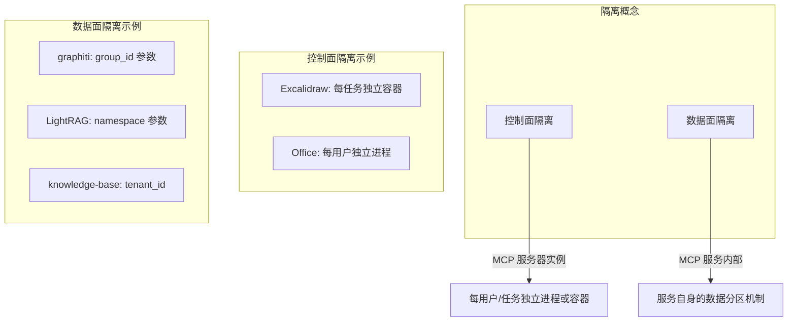
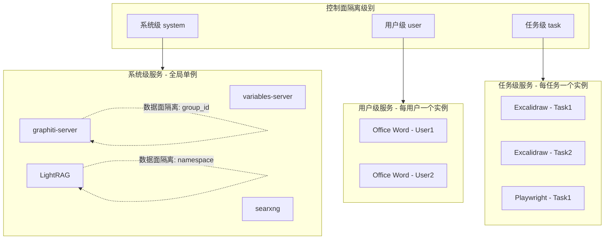
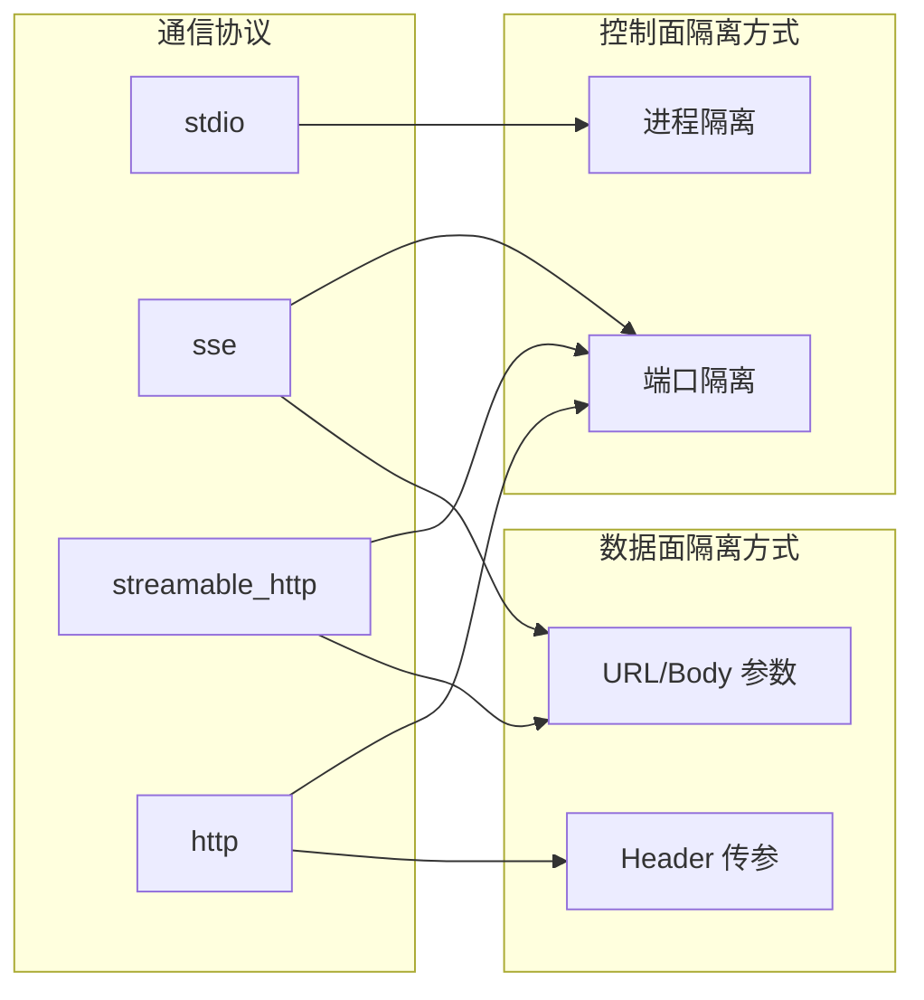
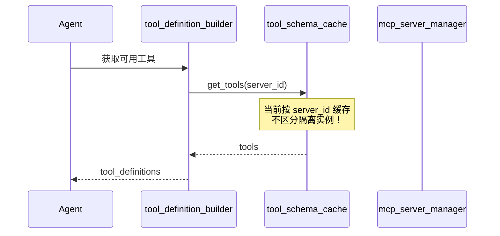
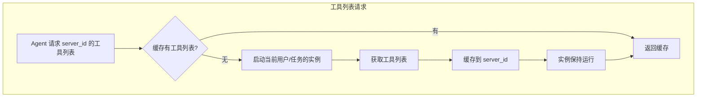
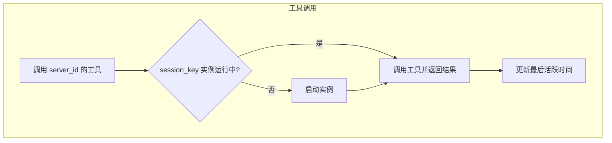
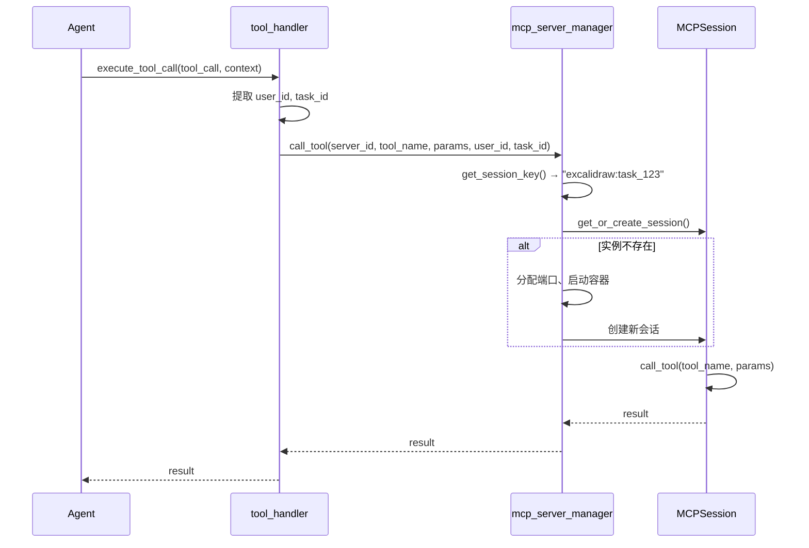
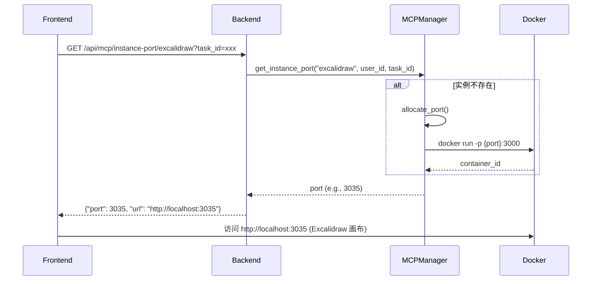
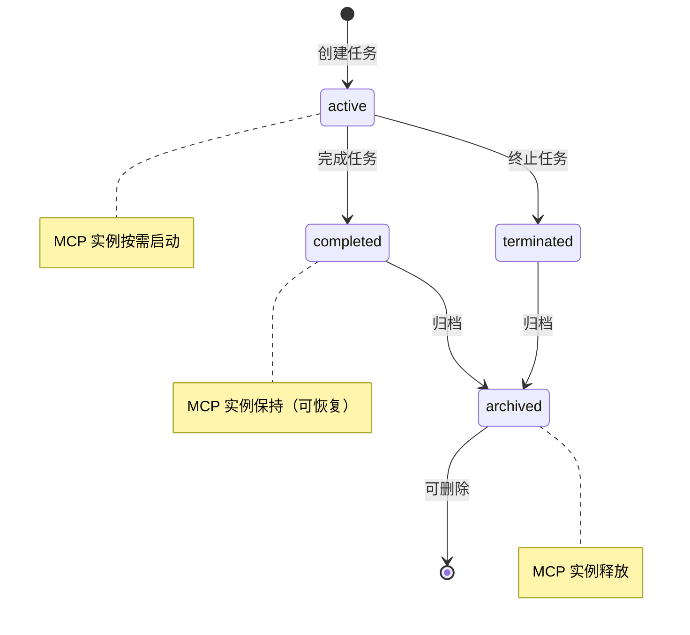
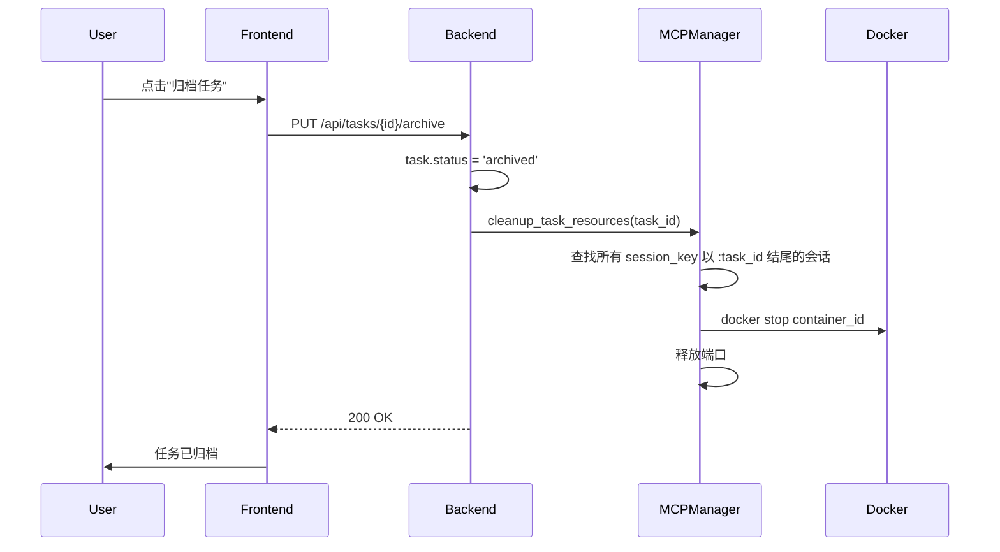

# MCP 服务器多级隔离架构

## 概述

实现系统 → 用户 → 任务三级 MCP 服务隔离架构，通过在配置中增加 `isolation_level` 字段，并改造 MCPServerManager 以支持按隔离级别管理不同粒度的会话实例。

## 1. 核心概念：控制面 vs 数据面隔离



### 1.1 控制面隔离

**定义**：MCP 服务器实例本身的隔离，即为不同用户/任务启动独立的服务进程或容器。

**适用场景**：
- 服务有状态且无法改造（如 Excalidraw 内存存储）
- 服务不支持多租户参数
- 需要完全隔离的安全要求

**资源消耗**：高（每实例占用独立资源）

### 1.2 数据面隔离

**定义**：MCP 服务器内部的数据分区机制，单实例通过参数区分不同租户的数据。

**适用场景**：
- 服务原生支持多租户参数（如 graphiti 的 `group_id`、LightRAG 的 `namespace`）
- 我们自己开发的内部服务（可添加 `tenant_id` 支持）

**资源消耗**：低（共享服务实例）

### 1.3 隔离策略选择规则

| 服务特性 | 控制面隔离 | 数据面隔离 | 推荐策略 |
|---------|-----------|-----------|---------|
| 外部服务 + 无多租户支持 | 需要 | 不可用 | 控制面隔离 |
| 外部服务 + 原生多租户支持 | 不需要 | 使用原生参数 | 数据面隔离 |
| 内部服务 | 不需要 | 添加 tenant_id | 数据面隔离 |

## 2. 架构设计



## 3. 核心原则

### 3.1 不改造外部 MCP 服务

> **重要**：外部 MCP 服务一律不做代码改造，避免 fork 和长期维护。
>
> - 避免 fork 和长期维护外部项目
> - 保持可直接升级到新版本
> - 降低技术债务

### 3.2 服务分类与隔离策略

| 服务 | 来源 | 控制面隔离级别 | 数据面隔离 | 说明 |
|------|------|---------------|-----------|------|
| variables-server | 内部 | system | 是（task_id） | 系统级单例，通过 task_id 参数区分数据 |
| planner-server | 内部 | system | 是（task_id） | 系统级单例，通过 task_id 参数区分数据 |
| knowledge-base | 内部 | system | 是（tenant_id） | 系统级单例，通过 tenant_id 参数区分数据 |
| graphiti-server | 外部 | system | 是（group_id） | 系统级单例，原生支持 group_id 数据分区 |
| LightRAG | 外部 | system | 是（namespace） | 系统级单例，原生支持 namespace 数据分区 |
| searxng | 外部 | system | 否（无状态） | 系统级单例，搜索服务无需隔离 |
| Office Word/Excel | 外部 | user | 否 | 每用户独立实例（工作目录分隔） |
| filesystem | 外部 | user | 否 | 每用户独立实例（目录参数分隔） |
| Excalidraw | 外部 | task | 否 | 每任务独立容器（内存存储无法共享） |
| playwright | 外部 | task | 否 | 每任务独立实例（浏览器状态隔离） |

## 4. 配置格式

### 4.1 KISS 简化说明

根据 KISS 原则，做了以下简化：

| 原设计 | 简化后 | 原因 |
|--------|--------|------|
| `data_isolation` 配置块 | **删除** | 复用现有 `inject_partition_identifier` 逻辑 |
| `tool_template` 预定义 | **删除** | 从首次启动的实例获取并缓存 |

保留的核心配置：
- `isolation_level` - 控制面隔离级别
- `port_range` - 动态端口范围
- `lifecycle` - 资源管理（超时回收、实例上限）

### 4.2 配置字段说明

```json
{
  "mcpServers": {
    "example-server": {
      "isolation_level": "system",      // 控制面隔离级别: system | user | task
      "internal": false,                // 是否内部服务
      "comm_type": "stdio",             // 通信协议
      "enabled": true,
      "command": "...",
      "args": ["..."],
      "port_range": [3030, 3100],       // 动态端口范围（user/task 级别需要）
      "lifecycle": {                    // 生命周期管理（user/task 级别需要）
        "lazy_start": true,             // 懒加载，首次使用才启动
        "idle_timeout_seconds": 1800,   // 空闲超时自动停止（秒）
        "max_instances_per_user": 5,    // 单用户实例上限
        "max_instances_global": 50      // 全局实例上限
      }
    }
  }
}
```

### 4.3 配置示例

```json
{
  "mcpServers": {
    "variables-server": {
      "isolation_level": "system",
      "internal": true,
      "comm_type": "stdio",
      "enabled": true
    },
    "graphiti-server": {
      "isolation_level": "system",
      "internal": false,
      "comm_type": "sse",
      "url": "http://10.7.0.22:8001/sse",
      "enabled": false
    },
    "Office-Word-MCP-Server": {
      "isolation_level": "user",
      "internal": false,
      "comm_type": "stdio",
      "command": "uvx",
      "args": ["--directory", "./agent-workspace/${USER_ID}", "--from", "office-word-mcp-server", "word_mcp_server"]
    },
    "excalidraw": {
      "isolation_level": "task",
      "internal": false,
      "comm_type": "stdio",
      "command": "docker",
      "args": ["run", "-i", "--rm", "-p", "${PORT}:3000", "mcp-excalidraw-abm"],
      "port_range": [3030, 3100],
      "lifecycle": {
        "lazy_start": true,
        "idle_timeout_seconds": 1800,
        "max_instances_per_user": 5,
        "max_instances_global": 50
      }
    }
  }
}
```

## 5. 会话标识符设计

控制面会话 key 格式按隔离级别变化：

- **system**: `{server_id}` (如: `graphiti-server`)
- **user**: `{server_id}:{user_id}` (如: `Office-Word-MCP-Server:user_abc123`)
- **task**: `{server_id}:{task_id}` (如: `excalidraw:task_xyz789`)

## 6. 不同通信协议的隔离实现



### 6.1 stdio 协议

每次创建会话启动独立进程，天然支持控制面隔离：

```python
# 配置中可使用占位符
"args": ["run", "-i", "--rm", "-p", "${PORT}:3000", "image"]
"args": ["--directory", "./workspace/${USER_ID}"]
```

### 6.2 sse/streamable_http 协议

**控制面隔离（端口隔离）**：
```json
{
  "url_template": "http://localhost:${PORT}/mcp",
  "port_range": [3030, 3100],
  "docker_image": "mcp-excalidraw-abm"
}
```

**数据面隔离**：

无需配置，复用现有 `tool_handler.py` 中的 `inject_partition_identifier` 逻辑。
graphiti 等服务的 `group_id` 参数会自动注入。

### 6.3 http 协议

通过 Header 传递租户信息：
```json
{
  "headers": {
    "X-User-ID": "${USER_ID}",
    "X-Task-ID": "${TASK_ID}"
  }
}
```

## 7. 工具发现与路由机制

### 7.1 问题：Agent 如何找到隔离实例的工具？

当前工具发现流程存在问题：



**核心概念区分**：

| 概念 | 说明 | 缓存/管理粒度 |
|------|------|-------------|
| **工具列表** | 静态信息，描述服务有哪些工具 | 按 `server_id`（全局唯一） |
| **实例** | 动态资源，实际运行的进程/容器 | 按 `session_key`（多个） |

同一个 MCP 服务器（如 excalidraw）的工具列表是**固定的**，不管是哪个用户/任务的实例。

### 7.2 解决方案：懒加载 + 分离缓存

**工具列表请求流程**：



**工具调用流程**：



**关键逻辑**：

1. **工具列表缓存**：按 `server_id` 缓存，首次请求时获取
   - 首个请求触发实例启动，获取工具列表后缓存
   - 后续请求直接返回缓存（即使该用户/任务的实例未启动）

2. **实例管理**：按 `session_key` 管理，懒加载
   - 首次调用工具时才启动实例
   - 实例保持运行直到闲置超时或归档

**示例**：excalidraw（任务级隔离）

```
工具列表缓存: "excalidraw" → [create_element, update_element, ...]

实例管理:
  - "excalidraw:task_T1" → 实例1 (端口3030, 活跃)
  - "excalidraw:task_T2" → 实例2 (端口3031, 活跃)
  - "excalidraw:task_T3" → 未启动（尚未调用工具）
```

### 7.3 实例生命周期

| 隔离级别 | 启动时机 | 销毁时机 | 实例数量 |
|---------|---------|---------|---------|
| **system** | 系统启动 | 系统关闭 | 1 个共享 |
| **user** | 首次调用工具 | 闲置超时（如30分钟） | 每用户 1 个 |
| **task** | 首次调用工具 | 任务归档 或 闲置超时 | 每任务 1 个 |

### 7.4 工具调用路由



### 7.5 工具发现与实例管理时机

| 时机 | 工具列表操作 | 实例操作 |
|------|-------------|---------|
| **系统启动时** | system 级：获取并缓存 | system 级：启动 |
| **Agent 请求工具列表时** | 有缓存返回；无缓存则触发首次调用 | 首次请求触发启动（懒加载） |
| **首次工具调用时** | 如无缓存则获取并缓存 | 启动实例 |
| **后续工具调用时** | 返回缓存 | 复用已有实例，更新活跃时间 |
| **闲置超时时** | 无操作 | 销毁实例 |
| **任务归档时** | 无操作 | 销毁该任务的实例 |

## 8. 核心代码修改

### 8.1 MCPServerManager 改造

在 `backend/app/services/mcp_server_manager.py` 中添加多级隔离支持：

**核心改造点**：
1. 按 `session_key` 管理多个实例
2. 工具列表按 `server_id` 缓存（全局唯一）
3. 实例懒加载 + 闲置超时销毁

完整的 MCPServerManager 改造：

```python
class MCPServerManager:
    def __init__(self):
        self._sessions: Dict[str, MCPSession] = {}  # key: session_key
        self._port_allocator = PortAllocator()       # 端口分配器
        self._container_manager = ContainerManager() # 容器管理器
        self._instance_ports: Dict[str, int] = {}    # 实例端口映射
    
    def get_session_key(self, server_id: str, server_config: dict, 
                        user_id: str = None, task_id: str = None) -> str:
        """根据控制面隔离级别生成会话标识符"""
        isolation_level = server_config.get('isolation_level', 'system')
        
        if isolation_level == 'task' and task_id:
            return f"{server_id}:{task_id}"
        elif isolation_level == 'user' and user_id:
            return f"{server_id}:{user_id}"
        else:
            return server_id
    
    def call_tool(self, server_id: str, tool_name: str, params: Dict,
                  user_id: str = None, task_id: str = None) -> Dict:
        """调用 MCP 工具，支持多级隔离"""
        server_config = self.servers_config.get('mcpServers', {}).get(server_id)
        
        # 数据面隔离：复用现有 tool_handler.py 中的 inject_partition_identifier
        # 无需额外配置，graphiti 等服务的参数注入已在 tool_handler 中处理
        
        # 获取或创建控制面会话
        session = self.get_or_create_session(server_id, user_id, task_id)
        
        # 调用工具
        loop = self._get_persistent_loop()
        if not session.is_ready:
            session.start(loop, timeout=60)
        
        return session.call_tool(loop, tool_name, params)
```

### 7.2 端口分配器

新建 `backend/app/services/port_allocator.py`：

```python
import socket
from typing import Dict, Tuple

class PortAllocator:
    """动态端口分配器"""
    def __init__(self):
        self._allocated_ports: Dict[str, int] = {}
    
    def allocate(self, session_key: str, port_range: Tuple[int, int]) -> int:
        """为会话分配可用端口"""
        if session_key in self._allocated_ports:
            return self._allocated_ports[session_key]
        
        start, end = port_range
        for port in range(start, end + 1):
            if port not in self._allocated_ports.values() and self._is_port_free(port):
                self._allocated_ports[session_key] = port
                return port
        raise RuntimeError(f"No available port in range {port_range}")
    
    def release(self, session_key: str) -> None:
        """释放端口"""
        self._allocated_ports.pop(session_key, None)
    
    def _is_port_free(self, port: int) -> bool:
        """检查端口是否可用"""
        try:
            with socket.socket(socket.AF_INET, socket.SOCK_STREAM) as s:
                s.bind(('localhost', port))
                return True
        except OSError:
            return False
```

### 7.3 容器生命周期管理

新建 `backend/app/services/container_manager.py`：

```python
import subprocess
import logging
from typing import Dict, Optional

logger = logging.getLogger(__name__)

class ContainerManager:
    """Docker 容器生命周期管理"""
    
    def __init__(self):
        self._containers: Dict[str, str] = {}  # session_key -> container_id
    
    def start_container(self, session_key: str, image: str, port: int, 
                        env: dict = None, internal_port: int = 3000) -> str:
        """启动容器，返回容器 ID"""
        container_name = f"mcp-{session_key.replace(':', '-').replace('_', '-')}"
        
        cmd = [
            'docker', 'run', '-d',
            '--name', container_name,
            '-p', f'{port}:{internal_port}',
            '--rm'
        ]
        
        if env:
            for k, v in env.items():
                cmd.extend(['-e', f'{k}={v}'])
        
        cmd.append(image)
        
        try:
            result = subprocess.run(cmd, capture_output=True, text=True, check=True)
            container_id = result.stdout.strip()
            self._containers[session_key] = container_id
            logger.info(f"Started container {container_name} (ID: {container_id[:12]})")
            return container_id
        except subprocess.CalledProcessError as e:
            logger.error(f"Failed to start container: {e.stderr}")
            raise RuntimeError(f"Failed to start container: {e.stderr}")
    
    def stop_container(self, session_key: str) -> None:
        """停止并删除容器"""
        container_id = self._containers.pop(session_key, None)
        if not container_id:
            return
        
        try:
            subprocess.run(['docker', 'stop', container_id], 
                          capture_output=True, check=True, timeout=30)
            logger.info(f"Stopped container {container_id[:12]}")
        except subprocess.CalledProcessError as e:
            logger.warning(f"Failed to stop container: {e.stderr}")
        except subprocess.TimeoutExpired:
            subprocess.run(['docker', 'kill', container_id], capture_output=True)
    
    def cleanup_orphan_containers(self, prefix: str = 'mcp-') -> int:
        """清理孤儿容器"""
        try:
            result = subprocess.run(
                ['docker', 'ps', '-a', '--filter', f'name={prefix}', '-q'],
                capture_output=True, text=True, check=True
            )
            container_ids = result.stdout.strip().split('\n')
            
            count = 0
            for cid in container_ids:
                if cid and cid not in self._containers.values():
                    subprocess.run(['docker', 'rm', '-f', cid], capture_output=True)
                    count += 1
            
            logger.info(f"Cleaned up {count} orphan containers")
            return count
        except Exception as e:
            logger.error(f"Failed to cleanup containers: {e}")
            return 0
```

### 7.4 工具调用上下文传递

修改 `backend/app/services/conversation/tool_handler.py`：

```python
def execute_tool_call(tool_call, context: dict = None):
    """执行工具调用，传递用户和任务上下文"""
    # 从 Flask g 对象或参数获取上下文
    user_id = context.get('user_id') if context else getattr(g, 'user_id', None)
    task_id = context.get('action_task_id') if context else getattr(g, 'action_task_id', None)
    
    # ... 省略中间代码 ...
    
    # 调用 MCP 服务时传递上下文
    result = mcp_manager.call_tool(
        server_id, 
        tool_name, 
        arguments,
        user_id=user_id,
        task_id=task_id
    )
```

## 8. 资源生命周期管理

### 8.1 任务生命周期钩子

在 `backend/app/services/action_task_service.py` 中添加：

```python
from app.services.mcp_server_manager import mcp_manager

class ActionTaskService:
    def delete_task(self, task_id: str):
        # 清理任务级 MCP 服务实例
        mcp_manager.cleanup_task_resources(task_id)
        
        # 原有删除逻辑...
        task = ActionTask.query.get(task_id)
        db.session.delete(task)
        db.session.commit()
```

### 8.2 资源清理方法

在 `mcp_server_manager.py` 中添加：

```python
def cleanup_task_resources(self, task_id: str) -> None:
    """清理指定任务的所有 MCP 服务实例"""
    keys_to_remove = [
        key for key in self._sessions.keys() 
        if key.endswith(f':{task_id}')
    ]
    
    for session_key in keys_to_remove:
        session = self._sessions.pop(session_key, None)
        if session:
            try:
                loop = self._get_persistent_loop()
                session.stop(loop)
            except Exception as e:
                logger.warning(f"Failed to stop session {session_key}: {e}")
        
        self._container_manager.stop_container(session_key)
        self._port_allocator.release(session_key)
    
    logger.info(f"Cleaned up {len(keys_to_remove)} MCP instances for task {task_id}")

def cleanup_user_resources(self, user_id: str) -> None:
    """清理指定用户的所有 MCP 服务实例"""
    keys_to_remove = [
        key for key in self._sessions.keys() 
        if f':{user_id}' in key
    ]
    
    for session_key in keys_to_remove:
        session = self._sessions.pop(session_key, None)
        if session:
            try:
                loop = self._get_persistent_loop()
                session.stop(loop)
            except Exception:
                pass
        self._container_manager.stop_container(session_key)
        self._port_allocator.release(session_key)
```

### 8.3 资源管理策略

由于外部服务采用控制面隔离会增加资源消耗，需要以下管理策略：

1. **懒加载**：任务首次使用 MCP 服务时才启动实例
2. **超时回收**：空闲一段时间后自动停止容器
3. **实例上限**：限制单用户/全局最大实例数
4. **资源池**：预热常用服务的实例池（可选）

## 9. API 端点扩展

### 9.1 获取实例端口

供前端访问如 Excalidraw 画布：

```python
# 在 mcp_servers.py 路由中添加
@bp.route('/api/mcp/instance-port/<server_id>', methods=['GET'])
@login_required
def get_instance_port(server_id):
    """获取当前用户/任务的 MCP 实例端口"""
    user_id = g.user.id
    task_id = request.args.get('task_id')
    
    port = mcp_manager.get_instance_port(server_id, user_id, task_id)
    
    if port is None:
        return jsonify({'error': 'Instance not found'}), 404
    
    return jsonify({
        'server_id': server_id,
        'port': port,
        'url': f'http://localhost:{port}'
    })
```

### 9.2 实例监控统计

供管理员查看 MCP 实例运行状态：

```python
# mcp_server_manager.py
class MCPServerManager:
    def get_instance_stats(self, server_id: str = None) -> Dict:
        """获取 MCP 实例统计信息"""
        if server_id:
            # 单个服务的统计
            sessions = [k for k in self._sessions.keys() if k.startswith(server_id)]
            config = self.servers_config.get('mcpServers', {}).get(server_id, {})
            
            return {
                'server_id': server_id,
                'isolation_level': config.get('isolation_level', 'system'),
                'total_instances': len(sessions),
                'active_instances': sum(1 for k in sessions if self._sessions[k].is_ready),
                'idle_instances': sum(1 for k in sessions if not self._sessions[k].is_ready),
                'ports_used': [self._instance_ports.get(k) for k in sessions if k in self._instance_ports],
                'max_instances_global': config.get('lifecycle', {}).get('max_instances_global'),
                'max_instances_per_user': config.get('lifecycle', {}).get('max_instances_per_user'),
                'sessions': sessions
            }
        else:
            # 全局统计
            stats_by_server = {}
            for sid in set(k.split(':')[0] for k in self._sessions.keys()):
                stats_by_server[sid] = self.get_instance_stats(sid)
            
            return {
                'total_servers': len(stats_by_server),
                'total_instances': sum(s['total_instances'] for s in stats_by_server.values()),
                'total_active': sum(s['active_instances'] for s in stats_by_server.values()),
                'total_idle': sum(s['idle_instances'] for s in stats_by_server.values()),
                'by_server': stats_by_server
            }

# mcp_servers.py 路由
@bp.route('/api/mcp/stats', methods=['GET'])
@login_required
def get_mcp_stats():
    """获取 MCP 实例统计（管理员）"""
    if not g.user.is_admin:
        return jsonify({'error': 'Admin only'}), 403
    
    server_id = request.args.get('server_id')
    stats = mcp_manager.get_instance_stats(server_id)
    
    return jsonify(stats)
```

## 10. 前端访问流程



## 11. 运行成本分析

### 11.1 单实例资源消耗

| 服务类型 | 内存 | CPU（空闲/活跃） | 冷启动时间 |
|---------|------|-----------------|-----------|
| Excalidraw（Docker） | 80-150 MB | 0.1% / 1-5% | 3-5 秒 |
| Office Word（uvx） | 50-100 MB | 0% / 1-3% | 1-2 秒 |
| playwright（Docker） | 200-400 MB | 0.1% / 5-10% | 5-10 秒 |

### 11.2 并发场景资源消耗

**控制面隔离（每任务/用户独立实例）**：

| 并发规模 | Excalidraw 内存 | 端口消耗 | 容器数 |
|---------|----------------|---------|-------|
| 10 任务 | 1-1.5 GB | 10 | 10 |
| 50 任务 | 5-7.5 GB | 50 | 50 |
| 100 任务 | 10-15 GB | 100 | 100 |

**数据面隔离（单实例 + 参数分区）**：

| 并发规模 | 内存（固定） | 端口消耗 | 容器数 |
|---------|------------|---------|-------|
| 10 任务 | 200-500 MB | 1 | 1 |
| 50 任务 | 200-500 MB | 1 | 1 |
| 100 任务 | 200-500 MB | 1 | 1 |

**资源消耗比**：控制面隔离约为数据面隔离的 **10-15 倍**

### 11.3 成本优化策略

**策略 1：懒加载 + 超时回收**

```json
"lifecycle": {
    "lazy_start": true,           // 首次使用才启动
    "idle_timeout_seconds": 1800  // 30分钟无活动自动停止
}
```

**效果**：实际运行实例数 = 活跃任务数（而非总任务数）

**策略 2：实例上限**

```json
"lifecycle": {
    "max_instances_per_user": 5,  // 单用户最多 5 个
    "max_instances_global": 50    // 全局最多 50 个
}
```

**效果**：避免资源耗尽，超限时排队等待或复用

**策略 3：容器资源限制**

```bash
docker run --memory=128m --cpus=0.5 ...
```

**效果**：限制单容器资源，防止单实例占用过多

### 11.4 部署建议

| 部署场景 | 并发任务 | 内存需求 | 建议服务器配置 |
|---------|---------|---------|---------------|
| 小型（个人/团队） | 5-10 | 1-2 GB | 4 GB RAM |
| 中型（部门） | 20-30 | 3-5 GB | 8 GB RAM |
| 大型（企业） | 50-100 | 8-15 GB | 16-32 GB RAM |

> **注意**：以上为 MCP 隔离服务的额外消耗，不包括后端主服务、数据库等基础设施。

## 12. 前端展示方案

### 12.1 MCP 服务器管理页面（管理员）

在系统设置 → MCP 服务器配置中，增加隔离级别选择和实例监控：

```
┌─────────────────────────────────────────────────────────────────────┐
│  MCP 服务器配置                                                      │
├─────────────────────────────────────────────────────────────────────┤
│  服务器名称: excalidraw                                              │
│  描述: 实时流程图                                                    │
│                                                                     │
│  隔离级别:                                                           │
│    ○ 全局     - 所有用户共享同一实例                                 │
│    ○ 用户级   - 每个用户独立实例                                     │
│    ● 任务级   - 每个任务独立实例（资源消耗较高）                      │
│                                                                     │
│  资源限制（仅用户级/任务级）:                                         │
│    最大实例数: [50]  单用户上限: [5]  空闲超时: [30] 分钟             │
│                                                                     │
│  ┌─────────────────────────────────────────────────────────────┐   │
│  │ 实例监控                                                     │   │
│  │ 运行实例: 12 / 50 (全局上限)                                 │   │
│  │ 活跃实例: 8 个  |  空闲实例: 4 个                             │   │
│  │ 端口使用: 3030-3041                                          │   │
│  │                                                             │   │
│  │ 实例列表:                                                    │   │
│  │ • excalidraw:task_abc123  [活跃]  端口:3030  用户:user1     │   │
│  │ • excalidraw:task_def456  [空闲]  端口:3031  用户:user2     │   │
│  │ • excalidraw:task_ghi789  [活跃]  端口:3032  用户:user1     │   │
│  │ ...                                                         │   │
│  │                                                             │   │
│  │ [刷新] [清理空闲实例]                                         │   │
│  └─────────────────────────────────────────────────────────────┘   │
│                                                                     │
│  [保存配置]                                                          │
└─────────────────────────────────────────────────────────────────────┘

┌─────────────────────────────────────────────────────────────────────┐
│  全局 MCP 实例监控                                                   │
├─────────────────────────────────────────────────────────────────────┤
│  总计: 17 个实例运行中 (15 活跃 / 2 空闲)                             │
│                                                                     │
│  excalidraw          [任务级]                                        │
│    运行实例: 12 / 50 (全局上限)                                      │
│    活跃: 8  |  空闲: 4                                               │
│    端口: 3030-3041                                                   │
│    [查看详情]                                                        │
│                                                                     │
│  Office-Word         [用户级]                                        │
│    运行实例: 5 / 无限制                                              │
│    活跃: 3  |  空闲: 2                                               │
│    [查看详情]                                                        │
│                                                                     │
│  variables-server    [系统级]                                        │
│    运行实例: 1 (共享)                                                │
│    活跃: 1  |  空闲: 0                                               │
│                                                                     │
│  [刷新] [清理所有空闲实例] [导出监控数据]                              │
└─────────────────────────────────────────────────────────────────────┘
```

### 12.2 角色管理页面 - 工具选择（普通用户）

用 **Tag 标签** 显示隔离级别，让用户了解工具特性：

```
┌─────────────────────────────────────────────────────────────────────┐
│  可用工具                                                            │
├─────────────────────────────────────────────────────────────────────┤
│                                                                     │
│  □ 🔧 variables-server                      [全局]                  │
│    ├─ get_task_var                                                  │
│    └─ set_task_var                                                  │
│                                                                     │
│  □ 🔧 graphiti-server                       [全局]                  │
│    ├─ add_memory          ⓘ 数据按任务隔离（group_id）              │
│    └─ search_memory                                                 │
│                                                                     │
│  ☑ 🔧 Office-Word-MCP-Server                [用户级]                │
│    └─ create_document                                               │
│                                                                     │
│  ☑ 🔧 excalidraw                            [任务级]                │
│    ├─ create_element                                                │
│    ├─ create_from_mermaid                                           │
│    └─ query_elements                                                │
│                                                                     │
│  ⓘ 提示：任务级工具会为每个任务创建独立实例，首次使用需要几秒启动     │
└─────────────────────────────────────────────────────────────────────┘
```

### 12.3 Tag 样式设计

| 标签 | 颜色 | 含义 | Hover 提示 |
|------|------|------|-----------|
| `[全局]` | 灰色 `#8c8c8c` | 共享资源 | "所有用户和任务共享同一服务实例" |
| `[用户级]` | 蓝色 `#1890ff` | 用户独占 | "每个用户拥有独立实例，同一用户的任务共享" |
| `[任务级]` | 橙色 `#fa8c16` | 任务独占 | "每个任务创建独立实例，首次使用需 3-5 秒启动" |

**补充标识**（可选）：

| 标识 | 说明 |
|------|------|
| `ⓘ 数据隔离` | 服务支持数据面隔离（如 graphiti 的 group_id） |
| `⚡ 已启动` | 当前任务的实例已运行中 |
| `💤 未启动` | 实例未启动，首次使用会有延迟 |

### 12.4 任务会话页面 - 实例状态显示（可选）

在任务会话中显示当前任务的 MCP 实例状态：

```
┌─────────────────────────────────────────────────────────────────────┐
│  任务: 产品规划讨论                                                  │
├─────────────────────────────────────────────────────────────────────┤
│  MCP 服务状态:                                                       │
│  ┌─────────────────────────────────────────────────────────────┐   │
│  │ excalidraw      [任务级]  ⚡ 运行中  端口:3035  [打开画布]    │   │
│  │ Office-Word     [用户级]  💤 未启动                          │   │
│  └─────────────────────────────────────────────────────────────┘   │
└─────────────────────────────────────────────────────────────────────┘
```

### 12.5 前端组件设计

```typescript
// IsolationLevelTag.tsx
interface IsolationLevelTagProps {
  level: 'system' | 'user' | 'task';
  showTooltip?: boolean;
}

const levelConfig = {
  system: {
    label: '全局',
    color: '#8c8c8c',
    tooltip: '所有用户和任务共享同一服务实例'
  },
  user: {
    label: '用户级',
    color: '#1890ff', 
    tooltip: '每个用户拥有独立实例，同一用户的任务共享'
  },
  task: {
    label: '任务级',
    color: '#fa8c16',
    tooltip: '每个任务创建独立实例，首次使用需 3-5 秒启动'
  }
};

export const IsolationLevelTag: React.FC<IsolationLevelTagProps> = ({ 
  level, 
  showTooltip = true 
}) => {
  const config = levelConfig[level];
  
  const tag = (
    <Tag color={config.color}>{config.label}</Tag>
  );
  
  return showTooltip ? (
    <Tooltip title={config.tooltip}>{tag}</Tooltip>
  ) : tag;
};
```

### 12.6 API 响应格式扩展

MCP 服务器列表 API 返回隔离级别信息：

```json
{
  "servers": [
    {
      "id": "excalidraw",
      "description": "实时流程图",
      "enabled": true,
      "isolation_level": "task",
      "isolation_level_display": "任务级",
      "tools": [
        {"name": "create_element", "description": "创建元素"},
        {"name": "create_from_mermaid", "description": "从 Mermaid 创建"}
      ]
    },
    {
      "id": "graphiti-server",
      "description": "图谱记忆",
      "enabled": false,
      "isolation_level": "system",
      "isolation_level_display": "全局"
    }
  ]
}
```

## 13. 任务归档与 MCP 资源释放

### 13.1 任务状态设计

当前状态 vs 新增状态：



| 状态 | 说明 | MCP 实例 | 可恢复 |
|------|------|---------|-------|
| `active` | 进行中 | 按需启动/保持 | - |
| `completed` | 已完成 | 保持（用户可能查看） | 可重新激活 |
| `terminated` | 已终止 | 保持 | 可重新激活 |
| `archived` | **已归档（新增）** | **释放** | 可取消归档 |

### 13.2 归档触发 MCP 资源释放



### 13.3 数据库变更

```python
# models.py - ActionTask
class ActionTask(BaseMixin, db.Model):
    __tablename__ = 'action_tasks'
    # ...
    status = Column(String(20), default='active')  # active, completed, terminated, archived
    archived_at = Column(DateTime)  # 归档时间（新增）
```

### 13.4 API 设计

```python
# action_task_routes.py

@bp.route('/api/tasks/<task_id>/archive', methods=['PUT'])
@login_required
def archive_task(task_id):
    """归档任务并释放 MCP 资源"""
    task = ActionTask.query.get_or_404(task_id)
    
    # 检查权限
    if task.user_id != g.user.id:
        return jsonify({'error': 'Permission denied'}), 403
    
    # 检查状态（只有 completed 或 terminated 可归档）
    if task.status not in ('completed', 'terminated'):
        return jsonify({'error': 'Only completed or terminated tasks can be archived'}), 400
    
    # 释放 MCP 资源
    mcp_manager.cleanup_task_resources(task_id)
    
    # 更新状态
    task.status = 'archived'
    task.archived_at = datetime.utcnow()
    db.session.commit()
    
    return jsonify({'success': True, 'message': 'Task archived'})


@bp.route('/api/tasks/<task_id>/unarchive', methods=['PUT'])
@login_required
def unarchive_task(task_id):
    """取消归档（恢复为 completed 状态）"""
    task = ActionTask.query.get_or_404(task_id)
    
    if task.status != 'archived':
        return jsonify({'error': 'Task is not archived'}), 400
    
    task.status = 'completed'  # 恢复为完成状态
    task.archived_at = None
    db.session.commit()
    
    return jsonify({'success': True, 'message': 'Task unarchived'})
```

### 13.5 前端 UI

```
┌─────────────────────────────────────────────────────────────────────┐
│  任务列表                                                            │
├─────────────────────────────────────────────────────────────────────┤
│  筛选: [全部 ▼] [活跃] [已完成] [已归档]                              │
├─────────────────────────────────────────────────────────────────────┤
│                                                                     │
│  📋 产品规划讨论          [已完成]        [重新激活] [归档]          │
│     创建于 2024-01-15                                               │
│                                                                     │
│  📋 竞品分析报告          [已归档]        [取消归档] [删除]          │
│     归档于 2024-01-10     ⓘ MCP 资源已释放                          │
│                                                                     │
└─────────────────────────────────────────────────────────────────────┘
```

### 13.6 与 MCP 隔离的集成

```python
# mcp_server_manager.py

def cleanup_task_resources(self, task_id: str) -> dict:
    """清理指定任务的所有 MCP 服务实例"""
    keys_to_remove = [
        key for key in self._sessions.keys() 
        if key.endswith(f':{task_id}')
    ]
    
    cleanup_result = {
        'task_id': task_id,
        'sessions_stopped': 0,
        'containers_stopped': 0,
        'ports_released': 0
    }
    
    for session_key in keys_to_remove:
        # 停止会话
        session = self._sessions.pop(session_key, None)
        if session:
            try:
                loop = self._get_persistent_loop()
                session.stop(loop)
                cleanup_result['sessions_stopped'] += 1
            except Exception as e:
                logger.warning(f"Failed to stop session {session_key}: {e}")
        
        # 停止容器
        if self._container_manager.stop_container(session_key):
            cleanup_result['containers_stopped'] += 1
        
        # 释放端口
        if self._port_allocator.release(session_key):
            cleanup_result['ports_released'] += 1
    
    logger.info(f"Task {task_id} cleanup: {cleanup_result}")
    return cleanup_result
```

## 14. MCP Gateway 统一入口方案（改进）

### 14.1 核心思路

**问题**：当前方案中，stdio/sse/http 等不同协议的 MCP 服务需要分别处理隔离逻辑，增加了复杂度。

**改进方案**：引入 **MCP Gateway** 作为统一 HTTP 入口，将所有 MCP 调用转换为 HTTP 接口，简化隔离管理。

```mermaid
flowchart TB
    subgraph clients [客户端]
        agent[Agent/Frontend]
    end
    
    subgraph gateway [MCP Gateway - 统一 HTTP 入口]
        router[路由层<br/>/mcp/{user_id}/{server_name}/...]
        auth[鉴权 & 会话管理]
        process_mgr[进程管理器]
    end
    
    subgraph adapters [协议适配层]
        stdio_adapter[stdio Adapter<br/>subprocess 管理]
        sse_adapter[SSE Adapter<br/>HTTP client]
        http_adapter[HTTP Adapter<br/>直接转发]
    end
    
    subgraph instances [MCP 实例]
        direction TB
        subgraph user_instances [用户级实例池]
            office_u1[Office - User1<br/>stdio process]
            office_u2[Office - User2<br/>stdio process]
        end
        
        subgraph task_instances [任务级实例池]
            excalidraw_t1[Excalidraw - Task1<br/>Docker:3030]
            excalidraw_t2[Excalidraw - Task2<br/>Docker:3031]
        end
        
        subgraph shared_instances [共享实例]
            graphiti[graphiti<br/>SSE server]
            searxng[searxng<br/>HTTP server]
        end
    end
    
    agent -->|HTTP Request| router
    router --> auth
    auth --> process_mgr
    
    process_mgr -->|stdio 服务| stdio_adapter
    process_mgr -->|sse 服务| sse_adapter
    process_mgr -->|http 服务| http_adapter
    
    stdio_adapter --> user_instances
    stdio_adapter --> task_instances
    sse_adapter --> shared_instances
    http_adapter --> shared_instances
```

### 14.2 架构优势

| 方面 | 当前方案 | Gateway 方案 |
|------|---------|-------------|
| **协议处理** | 每种协议独立实现隔离 | 统一 HTTP 入口，协议透明 |
| **路由管理** | 分散在各处 | 集中在 Gateway 路由层 |
| **鉴权** | 每次调用都需验证 | Gateway 统一鉴权 + 会话管理 |
| **实例管理** | MCPServerManager 直接管理 | Process Manager 专职管理 |
| **监控日志** | 分散 | 集中在 Gateway 层 |
| **扩展性** | 新增协议需改造多处 | 只需添加新 Adapter |

### 14.3 路由设计

**统一路径格式**：
```
/mcp/{user_id}/{server_name}/{action}
```

**示例**：
```bash
# 获取工具列表
GET /mcp/user_abc/excalidraw/tools

# 调用工具
POST /mcp/user_abc/excalidraw/call_tool
{
  "tool_name": "create_element",
  "arguments": {...},
  "task_id": "task_xyz"  # 任务级隔离时需要
}

# 获取实例状态
GET /mcp/user_abc/excalidraw/status?task_id=task_xyz
```

### 14.4 协议适配器

**stdio Adapter**：
```python
class StdioAdapter:
    """stdio 协议适配器 - 管理子进程"""
    
    def __init__(self):
        self._processes: Dict[str, subprocess.Popen] = {}
    
    def start_instance(self, session_key: str, config: dict) -> None:
        """启动 stdio 进程"""
        cmd = self._build_command(config)
        process = subprocess.Popen(
            cmd,
            stdin=subprocess.PIPE,
            stdout=subprocess.PIPE,
            stderr=subprocess.PIPE
        )
        self._processes[session_key] = process
    
    def call_tool(self, session_key: str, tool_name: str, params: dict) -> dict:
        """通过 stdio 调用工具"""
        process = self._processes.get(session_key)
        if not process:
            raise RuntimeError(f"Instance {session_key} not found")
        
        # MCP stdio 协议通信
        request = json.dumps({
            "jsonrpc": "2.0",
            "method": "tools/call",
            "params": {"name": tool_name, "arguments": params},
            "id": str(uuid.uuid4())
        })
        
        process.stdin.write((request + "\n").encode())
        process.stdin.flush()
        
        response = process.stdout.readline().decode()
        return json.loads(response)
    
    def stop_instance(self, session_key: str) -> None:
        """停止进程"""
        process = self._processes.pop(session_key, None)
        if process:
            process.terminate()
            process.wait(timeout=5)
```

**SSE Adapter**：
```python
class SSEAdapter:
    """SSE 协议适配器 - HTTP 客户端"""
    
    def __init__(self):
        self._clients: Dict[str, httpx.Client] = {}
    
    def start_instance(self, session_key: str, config: dict) -> None:
        """创建 SSE 客户端（可能需要启动容器）"""
        url = config.get('url')
        if '${PORT}' in url:
            # 需要动态端口，启动容器
            port = self._allocate_port()
            self._start_container(session_key, config, port)
            url = url.replace('${PORT}', str(port))
        
        self._clients[session_key] = httpx.Client(base_url=url)
    
    def call_tool(self, session_key: str, tool_name: str, params: dict) -> dict:
        """通过 SSE 调用工具"""
        client = self._clients.get(session_key)
        response = client.post('/call_tool', json={
            "tool_name": tool_name,
            "arguments": params
        })
        return response.json()
```

### 14.5 进程管理器

```python
class ProcessManager:
    """统一的实例生命周期管理"""
    
    def __init__(self):
        self._adapters = {
            'stdio': StdioAdapter(),
            'sse': SSEAdapter(),
            'http': HTTPAdapter()
        }
        self._instances: Dict[str, InstanceInfo] = {}
        self._last_active: Dict[str, datetime] = {}
    
    def get_or_create_instance(self, session_key: str, config: dict) -> InstanceInfo:
        """获取或创建实例（懒加载）"""
        if session_key in self._instances:
            self._last_active[session_key] = datetime.now()
            return self._instances[session_key]
        
        # 检查实例上限
        self._check_instance_limits(config)
        
        # 启动实例
        comm_type = config.get('comm_type', 'stdio')
        adapter = self._adapters[comm_type]
        adapter.start_instance(session_key, config)
        
        instance_info = InstanceInfo(
            session_key=session_key,
            comm_type=comm_type,
            started_at=datetime.now()
        )
        self._instances[session_key] = instance_info
        self._last_active[session_key] = datetime.now()
        
        return instance_info
    
    def call_tool(self, session_key: str, tool_name: str, params: dict) -> dict:
        """调用工具"""
        instance = self._instances.get(session_key)
        if not instance:
            raise RuntimeError(f"Instance {session_key} not found")
        
        adapter = self._adapters[instance.comm_type]
        result = adapter.call_tool(session_key, tool_name, params)
        
        self._last_active[session_key] = datetime.now()
        return result
    
    def cleanup_idle_instances(self, idle_timeout: int = 1800) -> int:
        """清理闲置实例"""
        now = datetime.now()
        to_remove = []
        
        for session_key, last_active in self._last_active.items():
            if (now - last_active).total_seconds() > idle_timeout:
                to_remove.append(session_key)
        
        for session_key in to_remove:
            self.stop_instance(session_key)
        
        return len(to_remove)
```

### 14.6 Gateway 路由实现

```python
# backend/app/routes/mcp_gateway.py

from flask import Blueprint, request, jsonify, g
from app.services.mcp_gateway import mcp_gateway

bp = Blueprint('mcp_gateway', __name__)

@bp.route('/mcp/<user_id>/<server_name>/tools', methods=['GET'])
@login_required
def get_tools(user_id, server_name):
    """获取工具列表"""
    # 鉴权
    if g.user.id != user_id:
        return jsonify({'error': 'Permission denied'}), 403
    
    # 从缓存获取工具列表（按 server_id 缓存）
    tools = mcp_gateway.get_tools(server_name)
    return jsonify({'tools': tools})


@bp.route('/mcp/<user_id>/<server_name>/call_tool', methods=['POST'])
@login_required
def call_tool(user_id, server_name):
    """调用工具"""
    # 鉴权
    if g.user.id != user_id:
        return jsonify({'error': 'Permission denied'}), 403
    
    data = request.json
    tool_name = data.get('tool_name')
    arguments = data.get('arguments', {})
    task_id = data.get('task_id')
    
    # 构建 session_key
    session_key = mcp_gateway.get_session_key(
        server_name, user_id, task_id
    )
    
    # 调用工具（自动懒加载实例）
    result = mcp_gateway.call_tool(
        session_key, tool_name, arguments
    )
    
    return jsonify(result)


@bp.route('/mcp/<user_id>/<server_name>/status', methods=['GET'])
@login_required
def get_instance_status(user_id, server_name):
    """获取实例状态"""
    if g.user.id != user_id:
        return jsonify({'error': 'Permission denied'}), 403
    
    task_id = request.args.get('task_id')
    session_key = mcp_gateway.get_session_key(
        server_name, user_id, task_id
    )
    
    status = mcp_gateway.get_instance_status(session_key)
    return jsonify(status)
```

### 14.7 与现有方案的集成

**渐进式迁移**：

1. **阶段 1**：保留现有 MCPServerManager，Gateway 作为可选入口
   - 现有代码继续使用 MCPServerManager
   - 新功能（如前端直接访问）使用 Gateway

2. **阶段 2**：逐步迁移到 Gateway
   - tool_handler.py 改为调用 Gateway API
   - MCPServerManager 变为 Gateway 的底层实现

3. **阶段 3**：完全统一
   - 所有 MCP 调用走 Gateway
   - MCPServerManager 重构为 ProcessManager

**配置兼容**：
```json
{
  "mcpServers": {
    "excalidraw": {
      "isolation_level": "task",
      "comm_type": "stdio",
      "gateway_enabled": true,  // 新增：是否启用 Gateway
      "command": "docker",
      "args": ["run", "-i", "--rm", "-p", "${PORT}:3000", "mcp-excalidraw-abm"]
    }
  }
}
```

### 14.8 实施优先级

| 优先级 | 任务 | 说明 |
|-------|------|------|
| **P0** | 完成当前隔离方案 | 先实现基础的多级隔离 |
| **P1** | 设计 Gateway 接口 | 定义 API 规范和数据结构 |
| **P2** | 实现 Adapter 层 | stdio/sse/http 适配器 |
| **P3** | 实现 Gateway 路由 | Flask 路由 + ProcessManager |
| **P4** | 前端集成 Gateway | 直接调用 Gateway API |
| **P5** | 迁移现有调用 | tool_handler 改用 Gateway |

### 14.9 Gateway 方案的额外收益

1. **前端直接访问**：前端可直接调用 Gateway API，无需经过后端转发
2. **跨语言支持**：Gateway 提供标准 HTTP 接口，任何语言都可调用
3. **负载均衡**：可在 Gateway 层实现负载均衡和限流
4. **监控告警**：集中的日志和指标采集点
5. **灰度发布**：可在 Gateway 层实现 A/B 测试和灰度发布

## 15. 实施待办

### 后端 - MCP 隔离

- [ ] 扩展 mcp_config.json 配置格式，添加 isolation_level、port_range、lifecycle 字段
- [ ] 实现 PortAllocator 端口分配器（支持检测端口可用性和并发安全）
- [ ] 实现 ContainerManager 容器生命周期管理（启动/停止/清理/超时回收）
- [ ] 改造 MCPServerManager 支持多级会话管理（session_key 机制）
- [ ] 实现 get_or_create_session() 懒加载实例
- [ ] 实现闲置超时检测和自动销毁机制
- [ ] 实现实例数量限制（单用户上限、全局上限）
- [ ] 修改 tool_schema_cache 按 server_id 缓存工具列表
- [ ] 修改 tool_handler.py 和 call_tool 传递 user_id/task_id 上下文
- [ ] 扩展 MCP 服务器列表 API 返回 isolation_level 信息
- [ ] 添加获取实例端口的 API 端点（/api/mcp/instance-port/<server_id>）
- [ ] 实现实例监控统计 API（/api/mcp/stats）
- [ ] 配置 Excalidraw 为任务级实例隔离服务

### 后端 - 任务归档

- [ ] ActionTask 模型添加 `archived` 状态和 `archived_at` 字段
- [ ] 数据库迁移脚本（添加 archived_at 字段）
- [ ] 实现 PUT /api/tasks/{id}/archive 归档接口
- [ ] 实现 PUT /api/tasks/{id}/unarchive 取消归档接口
- [ ] 归档时调用 mcp_manager.cleanup_task_resources() 释放资源
- [ ] 任务删除时也调用资源清理（已有逻辑增强）

### 前端 - MCP 隔离

- [ ] 创建 IsolationLevelTag 组件（全局/用户级/任务级标签）
- [ ] MCP 服务器管理页面增加隔离级别配置选项
- [ ] MCP 服务器管理页面增加实例监控面板（实例数/活跃数/端口/实例列表）
- [ ] 实现全局 MCP 实例监控页面（所有服务的统计汇总）
- [ ] 添加"刷新"和"清理空闲实例"操作按钮
- [ ] 角色管理页面工具列表显示隔离级别标签
- [ ] 前端根据 task_id 调用 API 获取端口并路由到对应 Excalidraw 实例

### 前端 - 任务归档

- [ ] 任务列表增加归档状态筛选（全部/活跃/已完成/已归档）
- [ ] 已完成/已终止任务显示"归档"按钮
- [ ] 已归档任务显示"取消归档"和"删除"按钮
- [ ] 已归档任务显示"MCP 资源已释放"提示
- [ ] 归档操作添加确认对话框

## 12. 参考：业界实践

### Dify 模式（逻辑隔离为主）

- 单服务实例 + `tenant_id` 参数过滤
- 所有数据按租户 ID 分区存储
- 仅代码执行使用沙箱隔离
- 优点：资源消耗低，高密度部署

### n8n 模式（实例隔离）

- 社区版不支持多租户
- 高隔离方案：每租户独立 n8n 实例
- 优点：隔离彻底，无数据泄露风险
- 缺点：资源消耗高

### 我们的方案（混合模式）

- 控制面隔离：外部无法改造的服务（如 Excalidraw）
- 数据面隔离：内部服务 + 原生支持多租户的外部服务（如 graphiti）
- 平衡资源消耗和隔离需求
