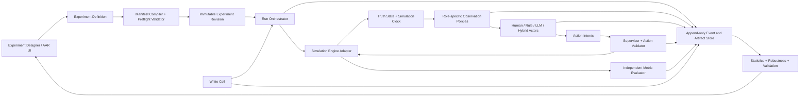

# ParallelLab v2 — Validated Cognitive Simulation and Decision Lab

> **Status:** Draft / proposed target architecture, not current product behavior
> **Date:** 2026-07-23
> **Product name used in this document:** Validated Cognitive Simulation and Decision Lab (可验证认知决策实验室)
> **Related stories:** [USER-STORIES-cognitive-simulation-v2.md](./USER-STORIES-cognitive-simulation-v2.md)
> **Current implementation PRD:** [PLAN-parallellab.md](./PLAN-parallellab.md)

## 1. Executive decision

ParallelLab should not compete with NetLogo or AnyLogic by rebuilding their
modeling languages, visualization editors, physics libraries, or mature
experiment runners. It should become the research control plane that connects
those engines to role-based LLM agents, reproducible experiment design,
independent measurement, validation, and auditable evidence.

The product thesis is:

> Deterministic or stochastic simulation engines adjudicate world state;
> cognitive agents make bounded decisions from role-specific observations;
> ParallelLab designs, executes, compares, and validates experiments without
> allowing the participants to grade themselves.

For conflict and security research, the first useful vertical slice is not a
general-purpose weapon-effect simulator. It is a synthetic command,
intelligence, logistics, and communications resilience experiment under
degraded communications and incomplete information. Its outputs are
model-conditional findings, not predictions of a real conflict.

## 2. Why this direction

Traditional Agent-Based Modeling (基于智能体建模, ABM) products are strong at
state transition, parameter sweeps, time control, visualization, and repeated
runs. Professional constructive simulation products are strong at domain data,
adjudication, interoperability, exercise control, and After-Action Review
(复盘分析, AAR). MesaLogo is differentiated by multi-agent cognition, tool use,
knowledge access, nested collaboration, and policy-constrained action.

The defensible product is therefore the intersection:

1. reuse an established engine for ground truth and time progression;
2. add bounded cognitive and organizational behavior;
3. make LLM model, prompt, memory, and policy explicit experimental factors;
4. produce statistical results and a complete provenance trail;
5. let a reviewer inspect why an outcome occurred, not only which run won.

This changes the core product question from “Can many agents run?” to:

> “Can a researcher make a bounded claim from repeated, reviewable runs?”

## 3. Current baseline and gap

The current ParallelLab is a useful MVP/Beta foundation. It already supports an
Action Space as the source scenario, cloned Action Tasks for run isolation,
parameter combinations, bounded concurrent execution, lifecycle operations,
step inspection, and a result summary.

The following table separates observed implementation from this proposal.

| Capability | Current baseline | ParallelLab v2 target |
|---|---|---|
| Experiment unit | Cloned Action Task | Immutable run manifest plus engine-backed run |
| Parameter exploration | Enumeration, step ranges, and random sampling | Factors, replications, paired baselines, sensitivity design, and declared stopping rules |
| Randomness | Limited seed support in configuration | Separate design, environment, actor, and evaluator seeds with provenance |
| Objective handling | Best run is chosen from the first objective | Independent metrics, uncertainty, effect sizes, constraints, and Pareto analysis |
| Execution | Existing large-scale concurrent experiment execution | Reuse the execution substrate while adding immutable run identity, evidence, and adapter semantics |
| Storage | Experiment-level JSON and cloned task IDs | Normalized runs and scalar metrics plus immutable artifact bundles |
| Engine integration | Action Task is the practical execution unit; NetLogo exists elsewhere in the product | Versioned adapter contract; first-class Action Task and headless NetLogo adapters |
| Validity | Configuration validation | Reproducibility checks, adapter parity, benchmark evidence, and purpose-validity level |
| Review | Run list, steps, and analysis views | Causal trace from observation to decision, accepted action, state change, and metric |

Important current limitations are visible in the repository:

- `ParallelExperiment` stores run IDs, pending combinations, and summaries in
  JSON fields on one experiment record.
- finalization selects a best run using only `objectives[0]`;
- execution remains coupled to the large
  `parallel_experiment_service.py` service and the current executor;
- run/actor evidence isolation and broad integration and end-to-end verification
  remain areas for the v2 scientific contract.

ParallelLab v2 must extend this baseline without representing proposed features
as already shipped.

## 4. Scope and claim boundary

### 4.1 In scope

- reproducible experiments over Action Task, NetLogo, and later external engines
  such as AnyLogic where licensing and runtime interfaces permit;
- human, rule-based, LLM-based, and hybrid actor policies in the same scenario;
- role-specific and delayed observations;
- explicit action validation and engine adjudication;
- replications, baselines, uncertainty intervals, effect sizes, robustness, and
  multi-objective analysis;
- complete run provenance, evidence export, and AAR;
- human White Cell (白方控制组) intervention with an audit trail;
- a synthetic degraded-communications decision-support reference scenario.

### 4.2 Explicitly out of scope for v2

- a new graphical modeling language competing with AnyLogic or NetLogo;
- a proprietary ballistic, sensor, damage, terrain, or weapon-effect database;
- real-world command-and-control actuation;
- claims that an LLM is a source of physical ground truth;
- “real-world win probability” from a synthetic model;
- formal accreditation without an external Verification, Validation, and
  Accreditation (验证、确认与认可, VV&A) process;
- automatic discovery of “emergence” without a preregistered definition and
  human review.

### 4.3 Required language in reports

Every generated report must state:

- the scenario and engine versions;
- the model, prompt, policy, tool, memory, and seed provenance;
- the number of valid, invalid, failed, and excluded runs;
- the supported validation level;
- the uncertainty and known model limitations;
- that findings are conditional on the modeled assumptions.

The product must not use “validated,” “verified,” or “accredited” as an
unqualified global label. Those terms apply to a named model version, purpose,
evidence set, and validation level.

## 5. Design principles

### P1. The engine owns truth and time

The engine owns simulation time, legal state transitions, and adjudicated
outcomes. LLM agents may propose actions but cannot directly mutate truth state.

### P2. Participants cannot grade themselves

Metrics are computed by an engine reporter or an independent evaluator. A
participant agent's natural-language claim is evidence about its belief, never
the authoritative outcome metric.

### P3. Observation is different from truth

Each role receives an observation produced by an explicit observation policy.
The policy can hide, delay, aggregate, corrupt, or redact state. The full truth
state is not silently inserted into an actor prompt.

### P4. Every result is a distribution

One run is a trace, not a conclusion. Comparative claims require declared
replications, valid-run accounting, uncertainty, and a baseline.

### P5. Reproducibility is an artifact

Configuration is frozen into an immutable Experiment Manifest (实验清单). The
manifest, code revision, engine/model versions, prompts, tools, data, seeds, and
artifacts are content-addressed or checksummed.

### P6. Failure is data, not missing data

Timeouts, policy rejections, malformed actions, engine errors, and manual stops
are terminal run outcomes. They are never silently discarded from the
denominator.

### P7. Human intervention is explicit

White-cell actions are allowed, but they create signed events with actor,
reason, affected scope, and simulation time. An intervention changes the
interpretation of the run and appears in analysis.

### P8. Preserve execution semantics

Run isolation, cancellation, terminal events, recovery, validity accounting,
and budget enforcement remain regression invariants for every experiment path.

## 6. Conceptual model

| Concept | Definition |
|---|---|
| Experiment Definition | Editable research intent: factors, metrics, policies, budgets, and comparison plan |
| Experiment Revision | Immutable, validated snapshot of a definition |
| Run | One factor assignment and one replication with its own seeds and lifecycle |
| Attempt | One execution attempt for a run; retry never overwrites the previous attempt |
| Engine Adapter | Versioned boundary that exposes state progression without leaking engine-specific control into the orchestrator |
| Actor Policy | Rule, human, LLM, or hybrid policy that maps an observation to an action intent |
| Observation Policy | Role-specific transformation from truth state to perceived state |
| Action Intent | A proposed action before permission checks and engine adjudication |
| Adjudicated Outcome | The engine-accepted state change or a structured rejection |
| Metric | Independently computed observation used for analysis |
| Artifact | Immutable manifest, event log, snapshot, prompt, response, table, chart, or report |
| Evidence Bundle | Checksummed set of artifacts needed to audit or reproduce a result |

## 7. Target architecture



### 7.1 Architectural boundaries

The existing large `parallel_experiment_service.py` should remain a legacy/MVP
boundary while v2 behavior is introduced in small modules. New domain logic
should not be appended to that file.

Proposed packages:

```text
backend-fastapi/app/services/simulation/
├── contracts.py
├── manifests.py
├── registry.py
├── orchestration.py
└── adapters/
    ├── action_task.py
    └── netlogo.py

backend-fastapi/app/services/experiment_analysis/
├── replications.py
├── statistics.py
├── robustness.py
└── validation.py
```

The package boundary is a design target, not permission to leave compatibility
re-exports. When implementation moves an internal symbol, all repository call
sites must move with it.

## 8. Simulation cycle

The canonical cycle is:

1. the adapter exposes current simulation time and truth state;
2. observation policies create a distinct observation for every active role;
3. actor policies decide only when an event or schedule requires a decision;
4. actors return typed action intents and optional rationale;
5. the supervisor checks identity, permission, scope, and policy;
6. the adapter validates domain legality and applies accepted actions;
7. the engine advances to the next event or time step;
8. independent reporters calculate metrics;
9. the orchestrator writes events and snapshots, then checks stop conditions.

LLM calls should be event-triggered rather than issued on every engine tick.
Background populations should use rules, archetypes, smaller models, or batch
approximations unless cognitive detail is a declared factor.

### 8.1 Canonical event envelope

Every material transition uses a common envelope:

```json
{
  "schema_version": "1.0",
  "experiment_id": "exp_...",
  "revision_id": "rev_...",
  "run_id": "run_...",
  "attempt_id": "attempt_...",
  "event_id": "evt_...",
  "event_type": "action.accepted",
  "simulation_time": 420,
  "wall_time": "2026-07-23T12:00:00Z",
  "actor_id": "logistics_lead",
  "causation_id": "evt_observation_...",
  "correlation_id": "decision_...",
  "payload_ref": "artifact://sha256/...",
  "payload_sha256": "..."
}
```

Large or sensitive payloads are stored as artifacts; the event log contains a
reference and digest. A trace must connect observation, prompt/policy input,
decision, action validation, engine outcome, and affected metrics.

## 9. Engine adapter contract

Adapters are asynchronous, capability-declared, and versioned. The target
contract is intentionally narrower than any one engine API.

| Operation | Responsibility |
|---|---|
| `describe()` | Return engine version, model identity, parameters, reporters, action schema, time semantics, and capabilities |
| `validate(manifest)` | Reject unsupported parameters, reporters, policies, or lifecycle requests before runs are queued |
| `create(run_context)` | Allocate an isolated engine instance for one run attempt |
| `reset(seed, parameters)` | Establish the declared initial state |
| `observe(role_id)` | Return a typed role-specific observation, never an implicit full-state dump |
| `validate_actions(intents)` | Return accepted/rejected intents with structured reasons |
| `apply_actions(intents)` | Apply accepted intents atomically where the engine supports it |
| `step(until)` | Advance one tick, one event, or to a declared simulation time |
| `metrics()` | Return authoritative engine reporters and their units |
| `snapshot()` / `restore()` | Create or restore a versioned checkpoint when supported |
| `cancel()` | Cooperatively stop work and release external resources |
| `close()` | Idempotently close the instance in success, failure, or cancellation |

Capability negotiation must expose at least:

- time mode: fixed tick, discrete event, or external clock;
- deterministic seeding support;
- snapshot/restore support;
- batch action support;
- reporter schema and units;
- maximum practical instance count;
- whether the engine can replay from an event log.

An adapter must not emulate a capability silently. Unsupported behavior fails
preflight validation.

## 10. Experiment manifest and reproducibility

An experiment becomes executable only after compilation into an immutable
manifest. A representative shape is:

```yaml
schema_version: "1.0"
purpose:
  question: "How does communications degradation affect logistics recovery?"
  intended_use: "Exploratory research on synthetic scenarios"
  claim_boundary: "Model-conditional comparison; not operational prediction"

scenario:
  adapter: "netlogo-headless"
  model_uri: "artifact://sha256/model_digest"
  model_version: "degraded-comms-v1"
  horizon: {simulation_minutes: 1440}

factors:
  packet_loss: {values: [0.0, 0.1, 0.3]}
  decision_policy: {values: ["sop-rules", "llm-policy-a"]}

replications:
  count: 30
  pairing: "common-random-numbers"
  seeds:
    design_seed: 1101
    environment_seed_base: 2101
    actor_seed_base: 3101
    evaluator_seed_base: 4101

actors:
  - role: "logistics_lead"
    policy_ref: "artifact://sha256/policy_digest"
    observation_policy_ref: "artifact://sha256/observation_digest"

metrics:
  primary:
    - {name: "recovery_time", unit: "simulation_minute", direction: "minimize"}
  secondary:
    - {name: "contradictory_order_count", unit: "count", direction: "minimize"}
  constraints:
    - {name: "critical_task_completion", operator: ">=", value: 0.8}

baselines:
  - "sop-rules"
  - "full-information-upper-bound"

analysis:
  confidence_level: 0.95
  report_effect_sizes: true
  missing_run_policy: "report-by-reason"
  stopping_rule: "fixed-replications"

budgets:
  max_wall_minutes: 240
  max_model_calls: 20000
  max_model_cost_usd: 300
```

The compiled manifest also records source revision, container/image digest,
Python and dependency lock hashes, engine binary version, model provider and
model identifier, decoding parameters, prompt/template hashes, tool schemas,
knowledge-base snapshot, memory policy, and redaction policy.

Provider-side nondeterminism must be disclosed. A recorded seed does not justify
a claim of deterministic reproduction when the selected model provider does not
offer that guarantee.

## 11. Persistence design

The existing `parallel_experiments` record can remain the editable definition
and lifecycle entry point during migration. V2 adds normalized, append-oriented
records. Exact names are subject to the database design review.

### 11.1 Proposed records

| Record | Purpose | Important fields |
|---|---|---|
| `experiment_revisions` | Immutable compiled manifest | experiment ID, revision number, manifest JSON, SHA-256, validation result, creator, created time |
| `experiment_runs` | One factor assignment and replication | revision ID, factor values, seed set, status, validity status, attempt count, times, stop reason, artifact root |
| `experiment_run_attempts` | Preserve retries and execution history | run ID, worker identity, lifecycle timestamps, terminal type, structured error, resource use |
| `experiment_run_metrics` | Queryable scalar outcomes | run ID, metric name, value, unit, aggregation window, validity flag |
| `experiment_artifacts` | Content and provenance index | run/revision ID, artifact kind, URI, media type, schema version, SHA-256, byte size |
| `experiment_interventions` | Auditable white-cell changes | run ID, simulation time, user, reason, command reference, impact scope |

High-volume events and time series should be stored as compressed JSONL or
Parquet artifacts with database indexes, not appended to a single JSON column.
Scalar metrics remain relational for comparison queries.

### 11.2 Data invariants

- revisions and completed attempts are immutable;
- a retry creates a new attempt;
- run status and terminal event agree;
- every scalar metric names its unit and evaluator source;
- every artifact has a checksum and schema version;
- deleting an experiment cannot silently delete shared source scenarios or
  externally retained evidence;
- foreign-key and retention behavior is explicit in the Alembic migration;
- schema work follows [database-changes.md](../agents/database-changes.md).

## 12. Orchestration and lifecycle

### 12.1 State model

```text
definition: draft -> validated -> frozen
experiment: created -> queued -> running -> paused -> completed
                                      |          |-> stopped
                                      |          |-> failed
                                      |          |-> completed_with_invalid_runs
run: planned -> queued -> starting -> running -> terminal
terminal: succeeded | invalid | failed | timed_out | cancelled | rejected
```

`invalid` is distinct from infrastructure failure. Examples include an engine
invariant violation, prohibited white-cell intervention, corrupt observation,
or an evaluator that cannot compute a preregistered primary metric.

### 12.2 Isolation and terminal semantics

- every run and actor stream has its own queue or subchannel;
- no two agents write into one undifferentiated result queue;
- concurrency is bounded at experiment, tenant, provider, and worker levels;
- cancellation propagates through scheduler, worker, model request, adapter,
  persistence, and client stream;
- every started run emits exactly one terminal event;
- errors emit structured error information and a terminal event;
- retry is explicit, bounded, and classified by error type;
- orchestrator state is persisted so process restart does not invent success or
  lose ownership of active work.

Implementation follows [parallel-execution.md](../agents/parallel-execution.md).

## 13. Statistical analysis contract

### 13.1 Minimum analysis for comparative claims

Every comparative report includes:

- valid, invalid, failed, excluded, and total run counts;
- mean, median, standard deviation, quantiles, and 95% confidence intervals where
  statistically appropriate;
- absolute difference and an appropriate standardized or domain effect size;
- the declared baseline and factor assignment;
- sensitivity to seeds and selected assumptions;
- paired analysis when common random numbers or paired scenarios were declared;
- raw run-level data or an export reference.

The UI must not label a condition “best” solely because it has the largest
single observed value.

### 13.2 Multi-objective experiments

Multiple objectives are handled with:

- hard constraints separated from optimization objectives;
- a Pareto frontier by default;
- optional weights only when the user explicitly declares them before analysis;
- no silent fallback to the first objective;
- confidence information attached to each objective.

### 13.3 Missingness and failures

Analysis reports outcomes by reason. Failed or invalid runs are not converted to
zero, ignored, or automatically retried until success. If a domain-specific
penalty is appropriate, it is a preregistered analysis rule and the unmodified
failure count remains visible.

### 13.4 Sequential stopping

Fixed replication counts are the default. Confidence-based or budget-aware
stopping is allowed only when the stopping rule, minimum replications, maximum
replications, monitored metric, and error control are frozen in the manifest.

## 14. Validation framework

Validation is purpose-specific and cumulative.

| Level | Name | Required evidence | Permitted claim |
|---|---|---|---|
| V0 | Executable | Schema/preflight checks and smoke run | “The scenario executes” |
| V1 | Reproducible | Immutable manifest, artifact hashes, seed accounting, repeat test | “The run can be reconstructed within documented limits” |
| V2 | Engine-verified | Invariants, regression suite, adapter parity, independent metric checks | “The implementation matches its specified mechanics” |
| V3 | Benchmark-validated | Comparison with accepted fixtures, historical/synthetic benchmark, or independent model | “The model reproduces named benchmark behaviors” |
| V4 | Purpose-validated | Domain expert review, sensitivity analysis, documented limits, approval for one intended use | “The named model version supports the named decision purpose” |

V4 is not platform-wide accreditation. Material changes to engine logic, source
data, actor policy, observation policy, model, prompt, or evaluator may require
revalidation.

For the NetLogo adapter, V2 includes parity tests against native BehaviorSpace
fixtures for parameter application, seeds, stop conditions, reporter values,
and replication counts.

## 15. First vertical slice: degraded communications

### 15.1 Research question

How do communications degradation, information delay, and decision policy
affect command coordination and logistics recovery in a synthetic organization?

### 15.2 Synthetic scenario

The first scenario uses no classified or operational dataset. Suggested roles:

- command lead;
- intelligence lead;
- operations lead;
- logistics lead;
- communications coordinator;
- white-cell controller.

The simulation engine owns a synthetic task network, resource flow, message
network, delays, failures, and task completion. Cognitive actors decide what to
request, prioritize, communicate, defer, or escalate based on role-filtered
observations.

### 15.3 Factors

- message loss, latency, and bandwidth;
- observation delay and error;
- organizational decision policy;
- actor policy type: SOP rules, LLM, or hybrid;
- staffing or span of control;
- information-sharing permissions;
- recovery playbook availability.

### 15.4 Primary outputs

- time to detect disruption;
- decision and coordination latency;
- critical-task completion rate;
- logistics backlog and recovery time;
- contradictory or superseded order count;
- communication load and unresolved request count;
- policy violations and rejected actions;
- human intervention count;
- model-call cost and wall-clock cost.

### 15.5 Required baselines

- deterministic SOP/rule policy;
- full-information upper bound;
- degraded communications with no adaptive policy;
- optionally, human-in-the-loop policy for a small reviewed sample.

### 15.6 Safety and interpretation

The reference scenario is for research methodology and organizational
resilience. It does not model weapon effects, identify real targets, control
real systems, or produce an operational recommendation. Reports use synthetic
labels and preserve the model-conditional claim boundary.

## 16. User experience

ParallelLab v2 has four primary workspaces.

### 16.1 Design

- state the research question and intended use;
- choose an engine adapter and scenario version;
- define factors, replications, seeds, metrics, baselines, and budgets;
- choose actor and observation policies;
- see a run-count/cost estimate;
- resolve preflight errors before freezing a revision.

### 16.2 Run monitor

- show experiment, run, attempt, and worker status separately;
- show valid/invalid/failed counts rather than one completion percentage;
- filter events by run, role, event type, and simulation time;
- expose pause, resume, stop, and white-cell controls according to permission;
- preserve terminal error details after streaming ends.

### 16.3 Analysis

- compare distributions and confidence intervals;
- show baseline differences and effect sizes;
- show constraints and Pareto trade-offs;
- expose sensitivity to seeds and factor assumptions;
- display a validation-level and limitations banner on every report.

### 16.4 AAR and evidence

- navigate from a metric change to engine events and actor decisions;
- compare two run traces at aligned simulation times;
- distinguish truth, observation, belief, intent, accepted action, and outcome;
- inspect white-cell interventions;
- export a checksummed evidence bundle.

## 17. Conceptual API surface

The exact HTTP design is deferred to implementation, but the domain operations
should remain explicit:

```text
POST   /experiments                         create editable definition
POST   /experiments/{id}/validate           run preflight checks
POST   /experiments/{id}/revisions          freeze immutable manifest
POST   /experiment-revisions/{id}/runs      plan/queue runs
GET    /experiment-runs/{id}                inspect lifecycle and validity
POST   /experiment-runs/{id}/cancel         request cooperative cancellation
POST   /experiment-runs/{id}/interventions  record authorized white-cell action
GET    /experiment-runs/{id}/events         query trace metadata
GET    /experiment-revisions/{id}/analysis  retrieve versioned analysis
POST   /experiment-revisions/{id}/export    build evidence bundle
```

Public API evolution needs a separate compatibility decision. Internal Python
and TypeScript moves must update all repository call sites without legacy import
shims.

## 18. Delivery roadmap and stage gates

### M0 — Scientific contract and thin adapter skeleton

Deliver:

- manifest, event, metric, lifecycle, and validation schemas;
- adapter protocol and a deterministic fake adapter;
- claim-boundary and report-language rules;
- architecture decision on artifact storage;
- contract and lifecycle tests.

Exit gate:

- the same fake run can be reconstructed from its manifest;
- invalid configuration fails before queueing;
- every started run reaches exactly one terminal state.

### M1 — Research core on the current Action Task engine

Deliver:

- normalized revisions, runs, attempts, scalar metrics, and artifact indexes;
- independent evaluator boundary;
- replications and separate seed domains;
- baseline comparison, confidence intervals, effect sizes, failure accounting,
  and Pareto analysis;
- evidence bundle v1;
- migration of in-repository ParallelLab analysis callers.

Exit gate:

- no report can infer “best” from one run or only the first objective;
- participant output cannot directly write an authoritative metric;
- deterministic fixtures reproduce within declared tolerance;
- schema upgrade and downgrade tests pass.

### M2 — Headless NetLogo adapter

Deliver:

- model describe/validate/reset/step/reporter/cancel lifecycle;
- parameter and seed mapping;
- snapshot capability when supported;
- native BehaviorSpace comparison fixtures;
- adapter resource quotas.

Exit gate:

- fixed models match native BehaviorSpace output within declared tolerances;
- cancellation releases every NetLogo process;
- unsupported model capabilities fail preflight.

### M3 — Degraded-communications reference study

Deliver:

- synthetic scenario, SOP baseline, observation policies, and LLM/hybrid policy;
- white-cell controls and AAR trace;
- preregistered reference experiment and report;
- domain-review checklist.

Exit gate:

- reviewers can trace each primary metric to engine events;
- the study has at least one rule baseline and declared replications;
- the report passes V2 and documents what is needed for V3/V4.

### M4 — External validation and federation

Deliver:

- benchmark packs and reviewer sign-off workflow;
- secure external-engine adapter template;
- purpose-specific validation dossier;
- optional standards bridge only after a concrete partner requirement.

Exit gate:

- one named scenario reaches V3;
- one external adapter passes the same contract suite;
- evidence export can be reviewed without production database access.

## 19. Product and engineering success measures

### Scientific integrity

- 100% of executed runs reference an immutable manifest and revision hash;
- 100% of scalar metrics identify unit and evaluator source;
- every comparative report exposes replication and failure counts;
- no participant message is accepted as an authoritative engine metric;
- no multi-objective report silently ranks by the first objective.

### Reliability

- no run or agent writes into another run's event channel in isolation tests;
- every started run produces exactly one terminal event;
- cancellation acknowledgement is prompt and final settlement occurs within the
  adapter/provider's declared timeout;
- restart recovery never converts unknown work into success;
- artifacts verify against stored checksums.

### Research usability

- a researcher can create a baseline comparison without editing JSON;
- a reviewer can navigate from a reported metric to its run-level evidence;
- the first NetLogo fixture can be run natively and through ParallelLab with a
  machine-readable parity result;
- the degraded-communications reference study can be rerun from its exported
  bundle in a clean environment, subject to documented provider limits.

## 20. Key risks and mitigations

| Risk | Consequence | Mitigation |
|---|---|---|
| LLM behavior is mistaken for ground truth | Invalid conclusions | Engine-owned truth, independent metrics, claim boundary |
| Prompt/model drift | Irreproducible results | Immutable hashes, provider/version capture, revalidation triggers |
| Shared queues or sessions | Cross-run contamination | Per-run channels, ownership assertions, isolation tests |
| Failed runs disappear from analysis | Selection bias | Terminal taxonomy and mandatory denominator reporting |
| JSON blobs grow without queryability | Fragile migrations and analysis | Normalized run/metric records; artifacts for high-volume data |
| Domain users over-interpret synthetic results | Unsafe decisions | Purpose statement, validation level, limitations banner, reviewer workflow |
| Costs grow with every tick | Unusable experiment economics | Event-triggered cognition, rule baselines, budgets, admission control |
| Adapter semantics diverge | Invalid engine comparison | Capability contract, parity fixtures, explicit unsupported states |
| White-cell edits are hidden | Unreviewable outcomes | Signed intervention events and analysis flags |

## 21. Decisions recorded by this proposal

### Accepted

- position ParallelLab as a validated experiment and evidence layer;
- keep simulation truth and cognitive policy as separate boundaries;
- make the first vertical slice organizational resilience under degraded
  communications;
- reuse the existing execution substrate and focus v2 on scientific validity;
- use normalized run records and immutable artifacts;
- implement Action Task and NetLogo through one adapter contract.

### Deferred

- exact distributed queue technology;
- exact artifact store product;
- an AnyLogic adapter, after the NetLogo contract proves the engine boundary;
- HLA, DIS, or TENA integration;
- purpose-specific external accreditation;
- Bayesian optimization and advanced experimental design after the basic
  replication contract is stable.

### Rejected for this phase

- replacing NetLogo/AnyLogic modeling environments;
- LLM adjudication of physical outcomes;
- a homemade weapon-effect database;
- automatic best-run selection from one objective and one realization.

## 22. Open decisions before implementation

1. Is the first artifact store local object storage, S3-compatible storage, or a
   pluggable URI abstraction from day one?
2. Which current ParallelLab HTTP surfaces remain public contracts, and which
   can be replaced in one coordinated release?
3. Does a frozen revision permit runtime-only budget reduction, or must any
   change create a new revision?
4. Which statistical library and serialization format become canonical?
5. What is the exact data-retention and redaction policy for prompts, memories,
   observations, and model responses?
6. Which two NetLogo models form the initial BehaviorSpace parity suite?
7. Who can authorize a V3 or V4 validation label for a named study?

These decisions should be resolved as Architecture Decision Records (架构决策记录,
ADRs) during M0, before schema or public API implementation.

## 23. References

### Repository evidence

- [Current ParallelLab PRD](./PLAN-parallellab.md)
- [Feature readiness snapshot](../agents/feature-readiness.md)
- [Parallel SSE interleave failure](../agents/failures/2025-XX-parallel-sse-interleave.md)
- [Autonomous task stop failure](../agents/failures/2025-11-autonomous-task-no-stop.md)
- [HTTP 400 silent hang failure](../agents/failures/2025-11-http-400-silent-hang.md)

### External product and research context

- [NetLogo BehaviorSpace documentation](https://docs.netlogo.org/7.0.4/behaviorspace)
- [AnyLogic parameter variation experiment](https://anylogic.help/anylogic/experiments/parameter-variation.html)
- [AnyLogic experiment types](https://anylogic.help/cloud/experiment/about.html)
- [Concordia: A Library for Generative Social Simulation](https://deepmind.google/research/publications/64717/)
- [Validation of agent-based models in the social sciences: a review](https://link.springer.com/article/10.1007/s10462-025-11412-6)
- [SimBench: Benchmarking Social Simulation with Large Language Models](https://arxiv.org/abs/2510.17516)
- [Generative Agent Simulations of 1,000 People](https://arxiv.org/abs/2411.10109)
- [Hybrid LLM and classical ABM position paper](https://arxiv.org/abs/2507.19364)
- [Joint Conflict and Tactical Simulation](https://computing.llnl.gov/projects/jcats)
- [VR-Forces](https://www.mak.com/mak-one/apps/vr-forces?catid=12&id=75&view=article)
- [Command Professional Edition capabilities](https://command.matrixgames.com/?page_id=3822)
- [TENA overview](https://www.tena-sda.org/tena-about.html)
- [TRADOC Regulation 5-11: Verification, Validation, and Accreditation](https://adminpubs.tradoc.army.mil/regulations/TR5-11.pdf)
