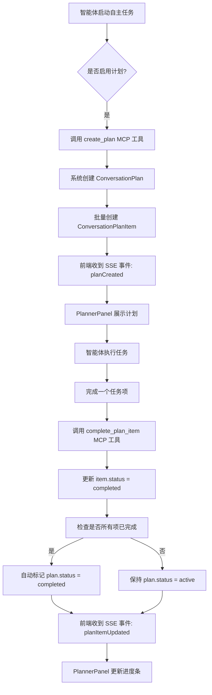

# PLANNER 功能实现总结

## 已完成的工作

### 1. 能力定义与 Seed Data ✅

#### 添加了 planner_management 核心能力
**文件**: `backend/app/seed_data/seed_data_capabilities.json`

定义了完整的能力参数：
- **操作类型**: create_plan, update_item, get_plan, add_item
- **参数结构**: 计划标题、描述、任务项列表、状态等
- **响应格式**: success, plan, message
- **示例用法**: 包含 3 个实际使用场景

**核心特性**:
- `type: "core"` - 作为核心能力，所有角色默认具备
- `default_enabled: true` - 自动启用
- `security_level: 1` - 基础安全级别

#### 添加了 MCP 工具映射
**文件**: `backend/app/seed_data/seed_data_capabilities_tools.json`

```json
{
  "planner_management": {
    "planner-server": [
      "create_plan",
      "update_plan_item", 
      "get_plan",
      "add_plan_item",
      "list_plans",
      "complete_plan_item",
      "reopen_plan_item"
    ]
  }
}
```

### 2. MCP 服务器实现 ✅

**文件**: `backend/app/mcp_servers/planner_server.py`

实现了 7 个工具函数：

#### 核心工具
1. **create_plan** - 创建执行计划
   - 参数: conversation_id, task_id, title, items, creator_agent_id
   - 功能: 创建计划并批量创建计划项
   - 返回: 完整的计划对象（含所有项）

2. **update_plan_item** - 更新计划项状态
   - 参数: conversation_id, plan_id, item_id, status, agent_id
   - 功能: 更新项状态，记录完成信息，自动同步计划状态
   - 智能特性: 所有项完成时自动标记计划为完成

3. **get_plan** - 获取计划详情
   - 参数: conversation_id, plan_id (可选)
   - 功能: 获取计划及所有项，计算进度统计
   - 智能特性: 不提供 plan_id 则返回最新活跃计划

4. **add_plan_item** - 添加新任务项
   - 参数: conversation_id, plan_id, title, agent_id
   - 功能: 向现有计划追加任务项
   - 智能特性: 自动设置正确的 order_index

#### 辅助工具
5. **list_plans** - 列出所有计划
   - 参数: conversation_id, status (可选)
   - 功能: 查询会话的所有计划，支持按状态筛选
   - 返回: 包含进度统计的计划列表

6. **complete_plan_item** - 快捷完成任务
   - 快捷方法，内部调用 update_plan_item
   - 简化智能体操作

7. **reopen_plan_item** - 重新打开任务
   - 快捷方法，将已完成/已取消的项重新打开
   - 自动清除完成信息

#### 技术亮点

**错误处理**:
- 完整的参数验证
- 数据库事务回滚
- 详细的错误消息

**智能同步**:
- 计划项状态变更自动更新计划状态
- 记录完成时间和完成人
- 自动维护 updated_at 时间戳

**日志记录**:
- 所有操作都有日志输出
- 便于调试和追踪

### 3. 文档完善 ✅

#### 核心设计文档
**文件**: `docs/feature-planner/PLAN.md`
- 完整的 UI 设计（展开/折叠状态）
- 数据库表结构设计
- API 接口设计
- MCP 工具定义
- 前端组件架构
- 8 个阶段的实施步骤
- 技术要点和注意事项

#### 项目 TODO
**文件**: `TODO.md`
- 添加了 PLANNER 功能章节
- 包含功能概述、UI 方案、实施步骤
- 与主要功能并列展示

## 核心能力工作流程

### 智能体如何使用 planner_management 能力



### Seed Data 初始化流程

当运行 `seed_data.py` 时：

1. **加载能力定义**
   ```python
   capabilities = json.load(open("seed_data_capabilities.json"))
   # planner_management 能力被加载
   # type="core" -> default_enabled=True, security_level=1
   ```

2. **关联 MCP 工具**
   ```python
   capability_tools = json.load(open("seed_data_capabilities_tools.json"))
   capability.tools = tools_data["planner-server"]
   # 7 个工具被关联到能力
   ```

3. **关联到所有角色**
   ```python
   core_capabilities = [cap for cap in capability_objects if cap.type == 'core']
   for role in roles:
       for cap in core_capabilities:
           role_cap = RoleCapability(role_id=role.id, capability_id=cap.id)
   ```

### 智能体调用流程

```python
# 智能体在对话中可以使用以下 MCP 工具调用：

# 1. 创建计划
response = mcp_call(
    tool="create_plan",
    params={
        "conversation_id": 123,
        "task_id": 456,
        "title": "产品开发执行计划",
        "description": "完整的产品开发流程计划",
        "items": [
            {"title": "需求分析", "description": "..."},
            {"title": "技术设计", "description": "..."},
            {"title": "开发实施", "description": "..."},
        ],
        "creator_agent_id": 789
    }
)
# 返回: {"success": true, "plan": {...}, "message": "..."}

# 2. 更新任务状态
response = mcp_call(
    tool="complete_plan_item",
    params={
        "conversation_id": 123,
        "plan_id": 1,
        "item_id": 1,
        "agent_id": 789
    }
)
# 返回: {"success": true, "message": "计划项状态已更新..."}

# 3. 查询计划
response = mcp_call(
    tool="get_plan",
    params={
        "conversation_id": 123
    }
)
# 返回: {"success": true, "plan": {...包含进度统计...}}
```

## 与现有系统的集成点

### 1. 能力系统集成
- `planner_management` 作为核心能力，通过 `RoleCapability` 关联到所有角色
- 角色创建智能体时，智能体自动继承该能力
- 在对话中，智能体可以使用 `planner-server` 的 7 个工具

### 2. MCP 系统集成
需要在 MCP 管理器中注册 `planner-server`：
```python
# backend/app/services/mcp_server_manager.py
from app.mcp_servers.planner_server import mcp as planner_mcp

mcp_servers = {
    "variables-server": variables_mcp,
    "knowledge-base": knowledge_mcp,
    "planner-server": planner_mcp,  # 新增
    # ...
}
```

### 3. 自主任务集成
在 `execute_planning_phase` 函数中引导智能体：
```python
planning_prompt = (
    f"请为即将开始的{mode_description}制定详细计划。"
    f"请使用 create_plan 工具创建结构化的执行计划，包含具体的任务项。\n"
    f"任务主题：{topic}"
)
```

## 下一步工作

### Phase 1: 数据库实现（当前优先级）
- [ ] 在 `models.py` 中添加 `ConversationPlan` 和 `ConversationPlanItem` 模型
- [ ] 创建数据库迁移文件
- [ ] 运行迁移创建表

### Phase 2: API 接口实现
- [ ] 创建 `backend/app/api/routes/conversations/plans.py`
- [ ] 实现 REST API 端点（GET/POST/PUT/DELETE）
- [ ] 添加 SSE 事件推送（planCreated, planItemUpdated）

### Phase 3: MCP 注册
- [ ] 在 `mcp_server_manager.py` 中注册 planner-server
- [ ] 测试 MCP 工具调用

### Phase 4: 自主任务集成
- [ ] 修改 `autonomous_task_utils.py` 的 `execute_planning_phase`
- [ ] 添加计划创建引导提示词
- [ ] 监听 MCP 工具调用，触发 SSE 事件

### Phase 5: 前端实现
- [ ] 创建 Planner 组件
- [ ] 集成到 ActionTaskConversation
- [ ] 实现 SSE 事件监听

## 技术细节

### 数据库表关系
```
ConversationPlan (1) ----< (N) ConversationPlanItem
       |                           |
       |                           |
   Conversation              (可选) Agent
       |
    ActionTask
```

### MCP 工具调用示例

**智能体视角**：
```
我需要为这个项目创建一个执行计划。

<tool_call>
{
  "tool": "create_plan",
  "parameters": {
    "conversation_id": 123,
    "task_id": 456,
    "title": "网站开发计划",
    "description": "开发企业官网",
    "items": [
      {"title": "需求分析"},
      {"title": "UI设计"},
      {"title": "前端开发"},
      {"title": "后端开发"},
      {"title": "测试部署"}
    ],
    "creator_agent_id": 789
  }
}
</tool_call>

系统返回：
{
  "success": true,
  "plan": {
    "id": 1,
    "title": "网站开发计划",
    "items": [...]
  },
  "message": "执行计划 '网站开发计划' 创建成功，包含 5 个任务项"
}

好的，我已经创建了包含5个阶段的开发计划。
```

### SSE 事件格式

**计划创建事件**：
```json
{
  "type": "planCreated",
  "planId": 1,
  "plan": {
    "id": 1,
    "title": "网站开发计划",
    "status": "active",
    "items": [...]
  }
}
```

**计划项更新事件**：
```json
{
  "type": "planItemUpdated",
  "planId": 1,
  "itemId": 1,
  "status": "completed",
  "planStatus": "active"
}
```

## 文件清单

### 新增文件
1. `backend/app/mcp_servers/planner_server.py` - MCP 服务器实现
2. `docs/feature-planner/PLAN.md` - 详细设计文档
3. `docs/feature-planner/IMPLEMENTATION_SUMMARY.md` - 本文件

### 修改文件
1. `backend/app/seed_data/seed_data_capabilities.json` - 添加 planner_management 能力
2. `backend/app/seed_data/seed_data_capabilities_tools.json` - 添加工具映射
3. `TODO.md` - 添加 PLANNER 功能描述

### 待创建文件（下一阶段）
1. `backend/app/models.py` - 添加数据库模型
2. `backend/app/api/routes/conversations/plans.py` - API 路由
3. `frontend/src/pages/actiontask/components/Planner/` - 前端组件目录
4. `frontend/src/services/api/planner.js` - 前端 API 服务

## 验证清单

运行 seed_data 后，验证以下内容：

1. **能力已创建**：
   ```sql
   SELECT * FROM capabilities WHERE name = 'planner_management';
   ```

2. **能力已关联到所有角色**：
   ```sql
   SELECT r.name, c.name 
   FROM role_capabilities rc
   JOIN roles r ON rc.role_id = r.id
   JOIN capabilities c ON rc.capability_id = c.id
   WHERE c.name = 'planner_management';
   ```

3. **工具映射已保存**：
   ```sql
   SELECT tools FROM capabilities WHERE name = 'planner_management';
   -- 应返回: {"planner-server": ["create_plan", ...]}
   ```

---

**创建日期**: 2025-12-05  
**状态**: Phase 2 完成，准备进入 Phase 1（数据库实现）  
**负责人**: ABM-LLM 开发团队
