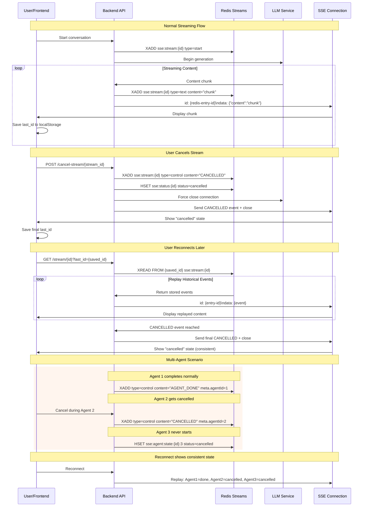

# Redis SSE 断线续传数据流图

## 数据流时序图



## 关键数据流说明

### 1. 双写机制
- **同步写入**：每个 SSE 事件同时写入 Redis Streams 和 HTTP 响应
- **ID 一致性**：SSE 的 `id:` 字段使用 Redis entry-id，确保幂等性
- **事件顺序**：Redis Streams 天然保证事件顺序，支持精确回放

### 2. 取消流程
- **立即响应**：用户点击取消后，前端立即显示取消状态
- **持久化取消**：CANCELLED 控制事件写入 Redis，确保重连时一致
- **连接清理**：HTTP 连接强制关闭，LLM 生成中止

### 3. 重连回放
- **位点恢复**：从 localStorage 读取 `last_id`，精确续传
- **历史回放**：XREAD 从断点开始回放所有历史事件
- **状态一致**：回放到 CANCELLED 事件时停止，不会越过取消点

### 4. 多智能体状态
- **独立状态**：每个 Agent 的完成/取消状态独立跟踪
- **编排控制**：通过 AGENT_START/AGENT_DONE/CANCELLED 控制事件管理切换
- **UI 同步**：前端根据控制事件更新"当前回复 Agent"状态

## 数据结构示例

### Redis Stream 事件格式
```json
{
  "type": "text|control|done|error",
  "content": "具体内容或控制信号",
  "seq": 123,
  "ts": 1704067200000,
  "meta": {
    "agentId": "agent_1",
    "role": "assistant",
    "delta": true
  }
}
```

### 控制事件类型
- `AGENT_START`: Agent 开始回复
- `AGENT_DONE`: Agent 完成回复  
- `CANCELLED`: 流被取消
- `ERROR`: 发生错误
- `DONE`: 整个对话完成

## 关键优势

1. **状态持久化**：取消状态存储在 Redis 中，重连时保持一致
2. **精确回放**：基于 entry-id 的精确位点恢复
3. **跨设备一致**：多标签页/多设备看到相同的取消状态
4. **性能优化**：XREAD BLOCK 高效等待新事件
5. **资源控制**：XTRIM 策略防止 Redis 内存膨胀

## 实施要点

- **双写适配器**：抽象 StreamWriter 统一处理 SSE + Redis 写入
- **回放端点**：支持 Last-Event-ID 和 last_id 参数的向后兼容
- **取消集成**：与现有 UUID 取消机制对齐
- **前端改造**：最小化改动，利用浏览器原生 Last-Event-ID 机制