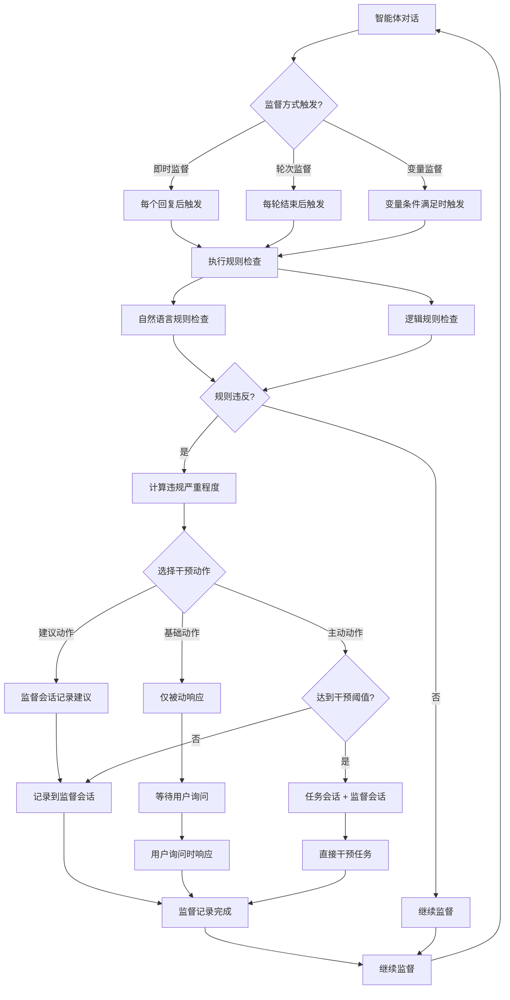

# 监督者工作流程文档

## TBD（不要动）
1. 监督者配置页面的要保存在数据库，需要修改字段，必要的选项作为单独字段，其他选项作为json保存
2. 监督者可以监督任何自主任务模式中的会话
3. 审计日志tab改名为监督审计
4. 逻辑规则与自然语言规则要完善，以触发监督者回复
5. 监督者不参与会话，只在监督审计tab中说话，说的每一句话都会被记录
6. 增加一个监督者的后端实现，包括会话管理
7. 监督和干预的区别是，干预会参与会话，监督只在监督审计中说话
8. 一个行动空间，目前暂定只允许配置一个监督者

## 概述

监督者系统通过**监督方式**触发**规则检查**（自然语言规则与逻辑规则），基于检查结果执行**干预动作**，实现对智能体任务的监督和管控。

## 核心概念

### 监督方式 (Supervision Mode)
监督方式决定了何时触发规则检查，是整个监督流程的起始点。

### 规则检查 (Rule Checking)
规则检查是监督的核心环节，检查是否违反自然语言规则与逻辑规则：
- **自然语言规则**：通过LLM分析对话内容是否符合规则描述
- **逻辑规则**：通过执行代码验证是否满足逻辑条件

### 干预动作 (Intervention Action)
干预动作决定了当规则检查发现违规时如何响应，包括在哪些渠道发送消息以及响应的积极程度。

## 监督方式详解

### 1. 即时监督方式
- **触发时机**：每个智能体回复后立即触发规则检查
- **检查频率**：高频率，实时检查
- **适用场景**：需要严格实时监控的场景

### 2. 轮次监督方式
- **触发时机**：每轮对话结束后触发规则检查
- **检查频率**：中等频率，周期性检查
- **适用场景**：一般业务场景，平衡监督与效率

### 3. 变量监督方式
- **触发时机**：基于任务变量条件触发规则检查
- **检查频率**：按设定间隔检查变量条件
- **触发机制**：通过检测任务空间中的变量与目标值对比来触发
- **适用场景**：基于特定条件的精确监督场景

## 监督方式与会话内容的关联性

### 与普通智能体消息的关联

#### 即时监督模式
```
用户发送消息 → 智能体响应 → 监督者立即检查
```
- **关联性**：每当任何智能体发送消息后，立即触发规则检查
- **检查内容**：单个消息的合规性、礼貌性、相关性
- **适用场景**：高风险场景，需要严格实时监控

#### 轮次监督模式
```
用户发送消息 → 多个智能体响应 → 本轮结束 → 监督者检查
```
- **关联性**：当一轮完整的对话结束后（所有相关智能体都发言完毕）触发检查
- **检查内容**：整轮对话的质量、逻辑一致性、目标达成度
- **适用场景**：平衡监督效果与系统性能的常规场景

#### 变量监督模式
```
智能体消息 → 影响监控变量 → 变量条件满足 → 监督者检查
```
- **关联性**：当消息导致相关变量变化且满足条件时触发
- **检查内容**：变量变化的合理性、趋势分析、阈值预警
- **适用场景**：基于特定指标或状态的精确监督

### 与自主任务的关联

#### 自动讨论任务
**即时监督**：
```
讨论任务启动 → 智能体A发言 → 立即检查 → 智能体B发言 → 立即检查 → ...
```
- 每个智能体发言后都进行检查
- 可以及时发现和纠正讨论偏离

**轮次监督**：
```
讨论任务启动 → 第1轮(所有智能体发言) → 检查 → 第2轮 → 检查 → ...
```
- 每轮讨论结束后进行整体评估
- 关注讨论质量和进展情况

**变量监督**：
```
讨论进行 → 讨论热度/质量指标变化 → 达到阈值 → 检查
```
- 基于讨论质量指标进行监控
- 如：参与度、争议程度、话题偏离度

#### 变量触发任务
**监督者与任务形成双重监控**：
```
变量条件满足 → 任务执行 → 智能体响应 → 监督者检查
                ↓
        监督者可以监控：
        - 任务触发是否合理
        - 执行过程是否符合规则
        - 结果是否符合预期
```

**变量监督模式特别适用**：
- 监督者监控的变量与任务触发变量可以不同
- 形成多层次的监控体系

#### 时间触发任务
**定期监督**：
```
定时触发 → 任务执行 → 智能体响应 → 监督者检查
```
- **即时监督**：每次定时执行后立即检查
- **轮次监督**：按时间周期批量检查多次执行结果
- **变量监督**：当执行结果影响监控变量时检查

### 监督者配置示例

#### 即时监督配置
```json
{
  "supervision_mode": "immediate",
  "triggers": {
    "after_each_agent": true,
    "after_each_round": false,
    "on_rule_violation": true
  },
  "intervention_settings": {
    "threshold": 0.6,
    "max_interventions_per_round": 5,
    "intervention_mode": "active"
  }
}
```

#### 轮次监督配置
```json
{
  "supervision_mode": "round_based",
  "triggers": {
    "after_each_agent": false,
    "after_each_round": true,
    "on_rule_violation": true
  },
  "intervention_settings": {
    "threshold": 0.7,
    "max_interventions_per_round": 2,
    "intervention_mode": "suggest"
  }
}
```

#### 变量监督配置
```json
{
  "supervision_mode": "variable_based",
  "variable_conditions": [
    {
      "type": "environment",
      "variable": "discussion_temperature",
      "operator": ">",
      "value": "0.8"
    }
  ],
  "condition_logic": "and",
  "check_interval": 60,
  "intervention_settings": {
    "threshold": 0.8,
    "intervention_mode": "active"
  }
}
```

### 实际应用场景

#### 正式会议场景
- **监督方式**：轮次监督
- **关联内容**：每轮发言结束后检查礼貌性、相关性
- **自主任务**：自动讨论任务按轮次监督
- **配置特点**：平衡监督效果与会议流畅性

#### 紧急决策场景
- **监督方式**：即时监督
- **关联内容**：每个消息都检查合规性、安全性
- **自主任务**：所有任务都实时监控
- **配置特点**：确保决策过程的严格合规

#### 长期项目监控
- **监督方式**：变量监督
- **关联内容**：关键指标变化时检查
- **自主任务**：变量触发任务与监督形成闭环
- **配置特点**：基于项目进度和质量指标的精确监督

## 规则检查详解

### 1. 自然语言规则检查
- **规则类型**：`type: "llm"`
- **检查方式**：使用LLM分析对话内容是否符合自然语言描述的规则
- **示例规则**：
  - "参与者在发言时必须保持礼貌和尊重"
  - "每次发言不得超过200字"
  - "不允许讨论与主题无关的内容"

### 2. 逻辑规则检查
- **规则类型**：`type: "logic"`
- **检查方式**：执行JavaScript/Python代码，返回布尔值判断是否违规
- **示例规则**：
  ```javascript
  // 检查发言长度
  return context.message.length <= 200;

  // 检查发言频率
  return context.userMessageCount <= 5;
  ```

### 3. 规则检查流程
1. **获取规则集**：从行动空间关联的规则集中获取所有激活的规则
2. **执行检查**：分别执行自然语言规则和逻辑规则检查
3. **汇总结果**：收集所有规则的检查结果和违规信息
4. **计算严重程度**：基于违规规则的重要性和数量计算违规严重程度

## 干预动作详解

### 1. 基础动作 (Basic Action)
- **任务会话**：❌ 不主动发消息
- **监督会话**：❌ 不主动发消息
- **响应条件**：仅当用户在监督会话中发送消息时才响应
- **特点**：完全被动响应，最基础的监督能力
- **适用场景**：初次使用，最安全的监督方式

### 2. 建议动作 (Suggest Action)
- **任务会话**：❌ 不主动发消息
- **监督会话**：✅ 当规则检查发现违规时主动记录建议
- **触发条件**：规则检查发现违规
- **特点**：平衡监督与自主性，不干预任务流程
- **适用场景**：日常监督，保持对话自然性

### 3. 主动动作 (Active Action)
- **任务会话**：⚠️ 当规则检查发现违规且达到干预阈值时主动发消息
- **监督会话**：✅ 主动记录监督记录和详细信息
- **触发条件**：规则检查发现违规 + 干预阈值判断
- **特点**：可能直接影响任务会话流程
- **适用场景**：严格管控，确保合规性

### 4. 用户主动干预
- **监督会话模式**：用户通过监督者UI咨询监督者，回复仅在监督者区域显示
- **任务会话模式**：用户通过监督者UI发送消息，监督者直接在任务会话中回复
- **触发条件**：用户主动选择发送目标
- **特点**：用户可控制监督者是否直接影响任务流程
- **适用场景**：需要监督者直接参与任务决策或提供指导

## 工作流程图



## 配置参数说明

### 监督方式参数
- **supervision_mode**: 监督方式类型
  - `immediate`: 即时监督
  - `round_based`: 轮次监督
  - `variable_based`: 变量监督

### 干预动作参数
- **intervention_mode**: 干预动作类型
  - `basic`: 基础动作
  - `suggest`: 建议动作
  - `active`: 主动动作

### 变量监督参数 (仅变量监督模式)
- **variable_conditions**: 变量条件列表
  - `type`: 变量类型 (`environment` | `agent`)
  - `variable`: 变量名称
  - `operator`: 比较运算符 (`>` | `>=` | `=` | `<=` | `<` | `!=`)
  - `value`: 目标值
- **condition_logic**: 条件逻辑 (`and` | `or`)
- **check_interval**: 检查间隔 (秒)

### 干预控制参数
- **threshold**: 干预阈值 (0-1)
- **max_interventions_per_round**: 每轮最大干预次数

## 使用建议

### 新手配置
- **监督方式**: 轮次监督 (每轮结束后触发规则检查)
- **干预动作**: 基础动作 (完全被动响应)
- **干预阈值**: 0.8 (保守，只在严重违规时记录)

### 日常使用
- **监督方式**: 轮次监督 (每轮结束后触发规则检查)
- **干预动作**: 建议动作 (规则违规时在监督会话中记录建议)
- **干预阈值**: 0.7 (平衡，适度监督)

### 严格管控
- **监督方式**: 即时监督 (每个回复后立即触发规则检查)
- **干预动作**: 主动动作 (规则违规且达到阈值时主动干预任务会话)
- **干预阈值**: 0.6 (积极，较低阈值确保及时干预)

### 条件监督
- **监督方式**: 变量监督 (基于任务变量条件触发规则检查)
- **干预动作**: 建议动作 (变量条件满足时在监督会话中记录建议)
- **干预阈值**: 0.7 (平衡，适度监督)
- **检查间隔**: 60秒 (定期检查变量条件)

## 注意事项

1. **监督方式决定检查时机**：选择合适的触发时机以平衡监督效果与系统性能
2. **规则检查是核心环节**：确保规则集配置完整，包含必要的自然语言规则和逻辑规则
3. **基础动作**是最安全的选择，适合初次使用和测试
4. **建议动作**平衡了监督效果与对话自然性，适合日常使用
5. **主动动作**可能直接影响任务流程，请谨慎使用并设置合理的干预阈值
6. 干预阈值越低，监督越积极，但可能产生过度干预
7. 变量监督方式适合基于特定条件的精确监督，需要合理设置检查间隔
8. 规则违反检测的准确性直接影响干预决策的质量
9. 变量条件配置应考虑任务的实际变量变化模式

## 实现记录

### 监督者配置界面优化 (ObserverManagement.js)

#### 术语标准化
- **监督模式** → **监督方式**：强调触发规则检查的时机
- **干预模式** → **干预动作**：明确基于规则检查结果的响应行为
- **流程修正**：监督方式 → 规则检查 → 干预动作

#### UI简化
- 移除冗余的Alert和tip组件，整合到问号tooltip中
- 新增**基础动作**作为默认选项，提供完全被动的监督模式
- 移除时间间隔触发选项，专注于事件驱动的监督机制
- 删除**条件监督**选项，将**混合监督**改为**变量监督**
- **变量监督**：基于任务变量条件触发，支持环境变量和智能体变量的条件配置

### 监督会话界面实现 (ActionTaskDetail.js + ActionTaskSupervisor.js)

#### 核心功能
- **术语更新**："监督日志" → "监督会话"，体现双向交互特性
- **流式输出**：监督者响应对话框，支持实时打字效果和状态指示
- **智能体选择**：下拉框形式选择监督者，支持搜索和统计信息显示
- **发送目标**：支持消息发送到"监督会话"或"任务会话"

#### 界面布局
```
监督者输出对话框 (流式显示)
用户输入区域 (TextArea)
监督者列表 [下拉框] ──── 发送目标 [监督会话|任务会话]
                    [发送消息]
监督会话历史记录
```

#### 发送目标说明
- **发送到监督会话**：
  - 用户消息和监督者回复都只在监督者UI区域显示
  - 不影响任务会话的上下文
  - 适用于咨询监督者意见、获取建议等场景

- **发送到任务会话**：
  - 用户消息和监督者回复都直接出现在任务会话中
  - 监督者作为参与者影响任务上下文和进程
  - 适用于监督者需要直接干预任务的场景

#### 技术特性
- 自动选择首个可用监督者
- 支持监督者搜索和过滤
- 模拟流式响应效果 (30ms间隔打字动画)
- 完整的错误处理和状态管理

### 关键设计原则

1. **分层职责**：监督方式(触发) → 规则检查(评估) → 干预动作(响应)
2. **用户体验**：从静态记录查看转为动态会话交互
3. **信息整合**：通过tooltip按需提供详细说明，保持界面简洁
4. **渐进配置**：基础动作 → 建议动作 → 主动动作的安全升级路径

### Message Source字段功能实现 (2024年实现)

#### 功能概述
为了实现监督者消息和任务消息的完全分离，在Message模型中添加了`source`字段，支持`supervisorConversation`和`taskConversation`两种值。

#### 核心实现
1. **数据库层面**：
   - 在Message表中添加`source`字段，默认值为`taskConversation`
   - 兼容旧数据，现有消息自动归类为任务会话
   - 添加索引优化查询性能

2. **后端API层面**：
   - 修改消息创建逻辑，根据`send_target`参数设置正确的source字段
   - 修复非流式消息处理中的参数传递问题
   - API响应包含source字段信息

3. **前端实现**：
   - 基于source字段实现消息筛选逻辑
   - 监督者会话只显示`supervisorConversation`消息
   - 任务会话只显示`taskConversation`消息

#### 技术细节
```python
# 消息分类逻辑
def set_message_source(send_target, target_agent_id):
    if send_target == 'supervisor':
        return 'supervisorConversation'
    else:
        return 'taskConversation'
```

#### 测试验证
- 创建完整的测试脚本验证功能正确性
- 验证API响应数据完整性
- 确保前端筛选逻辑正确工作
- 验证数据库数据分类正确

### 监督者会话历史记录显示格式实现 (2024年实现)

#### 功能概述
在监督者会话tab中，历史记录按照`监督者名称[角色][ID]`格式显示，提升用户体验和信息可读性。

#### 显示格式规范
1. **监督者回复显示**：`监督者名称[角色名称][ID: 智能体ID]`
   - 示例：`风险评估师[风险评估师][ID: 13]`

2. **用户发送给监督者的消息显示**：`用户 → 监督者名称[角色名称][ID: 智能体ID]`
   - 示例：`用户 → 风险评估师[风险评估师][ID: 13]`

#### 技术实现
```javascript
// 监督者回复显示格式
senderName = `${agent.name}[${agent.role_name || '监督者'}][ID: ${agent.id}]`;

// 用户消息显示格式
senderName = `用户 → ${targetAgent.name}[${targetAgent.role_name || '监督者'}][ID: ${targetAgent.id}]`;
```

#### 调试支持
- 添加详细的调试日志帮助排查显示问题
- 创建前端调试脚本和独立测试页面
- 验证API返回数据包含必要的`role_name`字段

#### 问题解决
- 解决前端显示"未知"的问题
- 确保监督者智能体数据完整性
- 提供完整的调试工具和解决方案

## 监督者会话实现设计（简化方案）

### 设计理念

监督者本质上是一个具有特殊角色的智能体，不需要过度复杂化。我们采用最小化修改的方式，复用现有的会话和消息系统。

### 核心设计思路

1. **监督者即智能体**：监督者就是 `Agent` 模型中 `is_observer=True` 的智能体
2. **消息类型扩展**：扩展 `Message` 模型的 `role` 字段，支持 `supervisor` 类型
3. **会话复用**：复用现有的会话系统，通过消息类型和智能体属性来区分监督者消息
4. **API复用**：基于现有的会话API进行扩展，而不是创建全新的API体系

### 数据库层面的最小修改

#### Message 模型扩展
```python
class Message(BaseMixin, db.Model):
    # 现有字段...
    role = Column(String(20), nullable=False)  # human, agent, system, tool, supervisor
    # 其他字段保持不变...
```

**role 字段当前支持的值：**
- `human` - 人类消息
- `agent` - 普通智能体消息
- `system` - 系统消息
- `tool` - 工具调用结果消息
- `supervisor` - 监督者消息（新增）

**会话类型通过 Conversation.mode 区分：**
- 任务会话：`mode='sequential/panel/debate/collaborative'`

### 监督者会话的实现方式

1. **后端实现**：
   - **无需专门的监督者会话**：所有消息都存储在现有的任务会话中
   - **监督者即特殊智能体**：`Agent` 模型中 `is_observer=True` 的智能体
   - **消息角色区分**：监督者发送的消息 `role='supervisor'`

2. **前端实现**：
   - **监督者会话是UI概念**：前端从会话消息中筛选 `role='supervisor'` 的消息单独显示
   - **监督者交互界面**：用户可以向监督者发送消息，监督者回复
   - **消息显示分离**：任务会话和监督者交互在不同的UI区域显示

3. **会话结构**：
   ```
   ActionTask
   └── Conversation (mode='sequential/panel/debate') - 任务会话
       └── Messages (role='human/agent/system/tool/supervisor')
           ├── 普通任务消息 (role='human/agent/system/tool')
           └── 监督者相关消息 (role='supervisor' 或发送给监督者的 role='human')
   ```

4. **消息流向**：
   ```
   # 发送到监督者会话
   用户 → 任务会话 → 监督者智能体 → 任务会话
   前端筛选 → 监督者UI区域显示监督者相关消息

   # 发送到任务会话（监督者干预）
   用户 → 监督者UI → 监督者智能体 → 任务会话（直接影响任务上下文）
   ```

### 计划新增的API接口

#### 1. 监督者消息API（复用现有会话API）

**发送消息给监督者**
```http
POST /api/action-tasks/{task_id}/conversations/{conversation_id}/messages
Content-Type: application/json

{
  "content": "用户向监督者发送的消息",
  "target_agent_id": 123  // 监督者智能体ID
}

Response:
{
  "message": "消息发送成功",
  "human_message": {
    "id": 456,
    "content": "用户向监督者发送的消息",
    "role": "human",
    "conversation_id": 999,
    "created_at": "2024-01-01T12:00:00Z"
  },
  "response": {
    "id": 457,
    "content": "监督者的回复内容",
    "role": "supervisor",
    "conversation_id": 999,
    "agent_id": 123,
    "created_at": "2024-01-01T12:00:01Z"
  }
}
```

**流式发送消息给监督者**
```http
POST /api/action-tasks/{task_id}/conversations/{conversation_id}/messages?stream=1
Content-Type: application/json

{
  "content": "用户向监督者发送的消息",
  "target_agent_id": 123  // 监督者智能体ID
}

Response: Server-Sent Events (SSE)
```

**获取会话消息（前端筛选监督者相关消息）**
```http
GET /api/action-tasks/{task_id}/conversations/{conversation_id}/messages

Response:
{
  "messages": [
    {
      "id": 456,
      "content": "消息内容",
      "role": "human|supervisor",
      "conversation_id": 999,
      "agent_id": 123,
      "created_at": "2024-01-01T12:00:00Z"
    }
  ]
}

// 前端筛选逻辑：
// 1. role='supervisor' 的消息（监督者发送的）
// 2. target_agent_id 指向监督者的 role='human' 消息（发送给监督者的）
```

**用户通过监督者UI发送消息到任务会话**
```http
POST /api/action-tasks/{task_id}/conversations/{conversation_id}/messages
Content-Type: application/json

{
  "content": "用户通过监督者界面发送的消息",
  "target_agent_id": 123,  // 监督者智能体ID
  "send_to_task": true     // 标识发送到任务会话
}

Response:
{
  "message": "消息发送成功",
  "human_message": {
    "id": 456,
    "content": "用户通过监督者界面发送的消息",
    "role": "human",
    "conversation_id": 999,
    "created_at": "2024-01-01T12:00:00Z"
  },
  "supervisor_response": {
    "id": 457,
    "content": "监督者在任务会话中的回复",
    "role": "supervisor",
    "conversation_id": 999,
    "agent_id": 123,
    "created_at": "2024-01-01T12:00:01Z"
  }
}

// 注意：这种情况下，监督者的回复直接出现在任务会话中，影响任务上下文
```

#### 2. 监督者状态API

**获取行动任务的监督者列表**
```http
GET /api/action-tasks/{task_id}/supervisors

Response:
{
  "supervisors": [
    {
      "id": 123,
      "name": "监督者名称",
      "role_name": "监督者角色",
      "is_observer": true,
      "status": "active",
      "supervision_settings": {
        "supervision_mode": "round_based",
        "intervention_mode": "suggestion"
      }
    }
  ]
}
```

**更新监督者配置**
```http
PUT /api/action-tasks/{task_id}/supervisors/{supervisor_id}/settings
Content-Type: application/json

{
  "supervision_settings": {
    "supervision_mode": "immediate",
    "intervention_mode": "active",
    "threshold": 0.8
  }
}
```

#### 3. 监督者规则检查API（复用现有规则测试API）

**监督者触发规则检查**
```http
POST /api/rules/test
Content-Type: application/json

{
  "rules": [
    {
      "id": 456,
      "name": "发言礼貌规则",
      "type": "llm",
      "content": "参与者在发言时必须保持礼貌和尊重"
    }
  ],
  "context": "最近的会话内容：用户A说：...",
  "role_id": 123,  // 监督者角色ID
  "variables": {
    "conversation_id": 789,
    "check_type": "manual"
  }
}

Response:
{
  "results": [
    {
      "rule_id": 456,
      "rule_name": "发言礼貌规则",
      "rule_type": "llm",
      "passed": false,
      "message": "规则不通过",
      "details": "检测到不礼貌用词，建议提醒参与者注意用词"
    }
  ],
  "timestamp": "2024-01-01T12:00:00Z"
}
```

### 实现阶段规划

#### 第一阶段：基础监督者会话
1. 扩展 `Message` 模型，支持 `role='supervisor'`
2. 修改消息处理逻辑，支持监督者智能体响应
3. 更新前端 `ActionTaskSupervisor.js` 组件，连接现有会话API
4. 实现前端消息筛选逻辑，分离显示监督者相关消息
5. 实现"发送到任务会话"功能，监督者可直接影响任务上下文

#### 第二阶段：监督者规则检查
1. 复用现有的规则测试API (`/api/rules/test`) 进行规则检查
2. 实现获取行动空间关联规则集的功能
3. 在监督者响应中集成规则检查逻辑
4. 实现手动触发规则检查功能（前端调用现有API）

#### 第三阶段：监督者状态管理和自动化
1. 实现监督者列表API
2. 实现监督者配置管理API
3. 实现自动触发的监督机制（即时监督、轮次监督、变量监督）
4. 在任务会话界面显示监督者消息
5. 完善监督者交互体验和干预功能

### 技术实现细节

#### 消息筛选和显示逻辑
前端需要实现以下筛选逻辑来分离监督者相关消息：

```javascript
// 筛选监督者相关消息
const filterSupervisorMessages = (messages, supervisorAgentIds) => {
  return messages.filter(message => {
    // 监督者发送的消息
    if (message.role === 'supervisor') {
      return true;
    }

    // 发送给监督者的人类消息
    if (message.role === 'human' && message.target_agent_id &&
        supervisorAgentIds.includes(message.target_agent_id)) {
      return true;
    }

    return false;
  });
};

// 筛选任务会话消息（排除纯监督者交互）
const filterTaskMessages = (messages, supervisorAgentIds) => {
  return messages.filter(message => {
    // 排除发送给监督者的人类消息（但保留监督者在任务会话中的回复）
    if (message.role === 'human' && message.target_agent_id &&
        supervisorAgentIds.includes(message.target_agent_id) &&
        !message.send_to_task) {
      return false;
    }

    return true;
  });
};
```

#### 监督者智能体识别
```javascript
// 识别监督者智能体
const getSupervisorAgents = (agents) => {
  return agents.filter(agent =>
    agent.is_observer ||
    agent.type === 'observer' ||
    (agent.role && agent.role.is_observer_role)
  );
};
```

#### 流式响应处理
监督者消息的流式响应需要特殊处理：

```javascript
// 监督者流式响应处理
const handleSupervisorStream = (eventSource, onMessage, onComplete) => {
  eventSource.onmessage = (event) => {
    const data = JSON.parse(event.data);

    if (data.role === 'supervisor') {
      // 监督者消息特殊处理
      onMessage({
        ...data,
        isSupervisor: true,
        timestamp: new Date().toISOString()
      });
    }
  };

  eventSource.onend = () => {
    onComplete();
    eventSource.close();
  };
};
```

### 数据库迁移注意事项

#### Message 模型修改
```sql
-- 添加 supervisor 到 role 字段的枚举值
ALTER TABLE messages MODIFY COLUMN role ENUM('human', 'agent', 'system', 'tool', 'supervisor') NOT NULL;

-- 可选：添加索引优化监督者消息查询
CREATE INDEX idx_messages_supervisor ON messages(role, agent_id) WHERE role = 'supervisor';
CREATE INDEX idx_messages_conversation_role ON messages(conversation_id, role);
```

#### 兼容性考虑
- 现有消息的 `role` 字段值保持不变
- 新增的 `supervisor` 角色不影响现有功能
- 前端需要向后兼容，处理没有监督者的情况

### 性能优化建议

#### 消息查询优化
```python
# 优化的监督者消息查询
def get_supervisor_messages(conversation_id, supervisor_agent_ids):
    return Message.query.filter(
        Message.conversation_id == conversation_id,
        db.or_(
            Message.role == 'supervisor',
            db.and_(
                Message.role == 'human',
                Message.agent_id.in_(supervisor_agent_ids)
            )
        )
    ).order_by(Message.created_at).all()
```

#### 缓存策略
- 监督者配置信息可以缓存，减少数据库查询
- 规则检查结果可以短期缓存，避免重复检查
- 监督者列表可以在行动空间级别缓存

### 错误处理和日志

#### 监督者错误处理
```python
# 监督者操作错误处理
try:
    supervisor_response = supervisor_agent.process_message(content)
except SupervisorError as e:
    logger.error(f"监督者处理失败: {str(e)}")
    # 发送错误消息到监督会话
    error_message = Message(
        content=f"监督者处理出错: {str(e)}",
        role='system',
        conversation_id=conversation_id
    )
    db.session.add(error_message)
    db.session.commit()
except Exception as e:
    logger.error(f"监督者未知错误: {str(e)}")
    # 记录到系统日志，不影响主流程
```

#### 监督日志记录
- 所有监督者操作都需要记录日志
- 规则检查结果需要详细记录
- 干预动作需要记录触发原因和结果
- 用户与监督者的交互需要完整记录

### 监督者与自主任务的集成

#### 自主任务监督触发点
监督者需要在以下自主任务关键节点进行监督：

1. **自动讨论任务 (AutonomousTask.type='discussion')**：
   - 任务启动时：检查讨论主题和参与智能体的合规性
   - 每轮讨论后：根据监督方式检查讨论质量和规则遵守
   - 任务结束时：评估讨论结果和总结质量

2. **变量触发任务 (AutonomousTask.type='variable_trigger')**：
   - 变量条件满足时：检查触发条件的合理性
   - 任务执行过程中：监督执行逻辑和结果
   - 变量更新后：验证变量变化的合规性

3. **时间触发任务 (AutonomousTask.type='time_trigger')**：
   - 定时触发时：检查触发时机和频率
   - 执行过程中：监督任务执行的质量
   - 执行结果：评估定时任务的效果

#### 监督者事件订阅机制
```python
# 监督者需要订阅的事件类型
SUPERVISOR_EVENTS = {
    'autonomous_task_started': '自主任务启动',
    'autonomous_task_round_completed': '自主任务轮次完成',
    'autonomous_task_completed': '自主任务完成',
    'agent_message_sent': '智能体发送消息',
    'variable_changed': '变量值变化',
    'rule_violation_detected': '规则违规检测'
}
```

#### 监督者干预自主任务的方式
1. **停止任务**：当检测到严重违规时，监督者可以停止自主任务
2. **调整参数**：修改任务配置参数，如讨论轮数、触发条件等
3. **发送指导消息**：向任务会话发送指导性消息
4. **记录监督日志**：在监督会话中记录问题和建议

### 监督者权限和安全机制

#### 监督者权限级别
1. **只读监督者**：只能观察和记录，不能干预
2. **建议监督者**：可以发送建议消息到监督会话
3. **干预监督者**：可以直接参与任务会话并影响流程
4. **管理监督者**：可以停止任务，修改配置

#### 安全限制
- 监督者不能删除或修改历史消息
- 监督者的干预次数受到配置限制
- 监督者的操作都会被记录和审计
- 监督者不能访问其他行动空间的数据

### 监督者数据流和状态管理

#### 监督者状态
```python
SUPERVISOR_STATES = {
    'inactive': '未激活',
    'monitoring': '监控中',
    'intervening': '干预中',
    'stopped': '已停止',
    'error': '错误状态'
}
```

#### 数据流向
```
行动任务事件 → 监督方式触发器 → 规则检查引擎 → 监督者智能体 → 干预动作执行器
     ↓              ↓                ↓              ↓              ↓
  事件记录      触发记录        检查结果记录    监督者消息     干预结果记录
```

### 优势

1. **最小化修改**：只需扩展现有的 `Message` 模型
2. **复用现有系统**：充分利用现有的会话、消息、智能体系统
3. **渐进式实现**：可以分阶段实现，每个阶段都有独立的价值
4. **易于维护**：保持代码简洁，避免过度设计
5. **向后兼容**：不影响现有功能的正常运行
6. **事件驱动**：基于现有的自主任务系统进行监督
7. **权限可控**：支持不同级别的监督权限

## 实现总结

### 核心要点

1. **简化设计原则**：监督者本质上是特殊的智能体，不需要复杂的独立系统
2. **复用现有架构**：充分利用现有的会话、消息、智能体、规则检查系统
3. **前端UI分离**：监督者会话只是前端的展示概念，后端统一存储
4. **灵活交互模式**：支持监督会话和任务会话两种发送目标
5. **事件驱动监督**：基于自主任务事件进行监督触发

### 关键技术决策

1. **Message.role 扩展**：添加 `supervisor` 角色类型，最小化数据库修改
2. **前端消息筛选**：通过 JavaScript 筛选逻辑分离监督者相关消息
3. **API复用策略**：复用现有会话消息API，通过参数区分监督者操作
4. **规则检查集成**：复用现有的 `/api/rules/test` API 进行规则检查
5. **流式响应支持**：监督者消息支持流式输出，提升用户体验

### 实现优先级

**第一优先级（核心功能）**：
- Message 模型扩展支持 supervisor 角色
- 前端监督者UI与现有会话API集成
- 基础的监督者交互功能

**第二优先级（规则集成）**：
- 监督者规则检查功能
- 手动触发规则检查
- 监督者配置管理

**第三优先级（自动化）**：
- 自动监督触发机制
- 监督者权限管理
- 完整的监督审计功能

### 风险控制

1. **向后兼容**：确保现有功能不受影响
2. **性能影响**：监督者功能不应显著影响系统性能
3. **权限安全**：监督者权限需要严格控制
4. **错误隔离**：监督者错误不应影响主要业务流程

### 测试策略

1. **单元测试**：Message 模型扩展、消息筛选逻辑
2. **集成测试**：监督者与会话系统的集成
3. **端到端测试**：完整的监督者交互流程
4. **性能测试**：大量消息情况下的筛选性能
5. **兼容性测试**：确保现有功能正常运行

这个设计方案在保持系统简洁性的同时，提供了完整的监督者功能，是一个平衡了复杂性和功能性的优秀方案。

## 监督者干预机制实现（2024年新增）

### 功能概述

实现监督者干预机制，支持监督者消息在任务会话中流式输出的同时，在监督会话tab中完整记录。

### 核心设计

#### 消息分类逻辑
1. **纯监督会话消息**：
   - `source = 'supervisorConversation'`
   - `meta.intervention` 不存在
   - 只在监督会话tab显示

2. **监督者干预消息**：
   - `source = 'supervisorConversation'`（保持监督会话记录）
   - `meta.intervention.display_in_task = true`
   - 同时在任务会话和监督会话中显示

3. **普通任务消息**：
   - `source = 'taskConversation'`
   - 只在任务会话中显示

#### Meta字段结构
```json
{
  "intervention": {
    "type": "info|warning|abort",
    "display_in_task": true,
    "source_ui": "supervisor"
  }
}
```

### 实现要点

#### 后端API修改
- 支持新的发送目标：`send_target = 'task_intervention'`
- 自动设置正确的`source`和`meta`字段
- 保持流式输出功能

#### 前端显示逻辑
- 任务会话框：显示`taskConversation`消息 + 干预标记的监督消息
- 监督会话tab：显示所有`supervisorConversation`消息
- 支持监督者在任务会话中的流式输出

## 监督者机制实现的关键部分

### 核心理念：极简设计

监督者机制的实现应该遵循**最小化修改，最大化复用**的原则，避免过度设计。

### 关键实现要点

#### 1. 数据层面的最小修改
```sql
-- 唯一必要的数据库修改
ALTER TABLE messages MODIFY COLUMN role ENUM('human', 'agent', 'system', 'tool', 'supervisor') NOT NULL;
```

**核心原则**：
- 监督者就是 `Agent` 模型中 `is_observer=True` 的智能体
- 监督者消息通过 `role='supervisor'` 标识
- 不需要额外的表、字段或复杂的状态管理

#### 2. API层面的复用策略
```http
# 复用现有会话消息API
POST /api/action-tasks/{task_id}/conversations/{conversation_id}/messages
{
  "content": "消息内容",
  "target_agent_id": 123  // 监督者智能体ID
}

# 复用现有消息获取API
GET /api/action-tasks/{task_id}/conversations/{conversation_id}/messages

# 复用现有智能体列表API
GET /api/action-tasks/{task_id}/agents?is_observer=true
```

**核心原则**：
- 不创建新的API端点
- 通过现有API参数区分监督者操作
- 利用现有的流式响应机制

#### 3. 前端实现的关键逻辑
```javascript
// 核心：消息筛选逻辑
const filterSupervisorMessages = (messages, supervisorAgentIds) => {
  return messages.filter(message =>
    message.role === 'supervisor' ||
    (message.role === 'human' && supervisorAgentIds.includes(message.agent_id))
  );
};

// 核心：监督者智能体识别
const getSupervisorAgents = (agents) => {
  return agents.filter(agent => agent.is_observer);
};

// 核心：发送目标控制
const sendToSupervisor = async (content, supervisorId, sendToTask = false) => {
  const finalContent = sendToTask
    ? `[监督者干预] ${content}`
    : content;

  return await sendMessage(finalContent, supervisorId);
};
```

**核心原则**：
- 监督者会话只是前端UI概念
- 通过消息筛选分离显示
- 通过消息内容前缀区分发送目标

#### 4. 监督者规则检查的集成
```python
# 在监督者消息处理中集成规则检查
def process_supervisor_message(content, supervisor_agent, conversation):
    # 1. 获取行动空间的规则集
    rule_sets = get_action_space_rule_sets(conversation.action_task.action_space_id)

    # 2. 构建检查上下文
    recent_messages = get_recent_messages(conversation.id, limit=10)
    context = build_rule_check_context(recent_messages, content)

    # 3. 执行规则检查（复用现有API）
    rule_results = check_rules_with_context(rule_sets, context, supervisor_agent.role_id)

    # 4. 将规则检查结果融入监督者响应
    supervisor_prompt = build_supervisor_prompt(supervisor_agent, context, rule_results)

    # 5. 生成监督者响应
    response = generate_agent_response(supervisor_agent, supervisor_prompt)

    return response
```

**核心原则**：
- 规则检查集成到监督者消息处理流程
- 复用现有的规则检查API (`/api/rules/test`)
- 不需要单独的规则检查端点

#### 5. 监督者与自主任务的集成
```python
# 在自主任务关键节点触发监督者检查
class AutonomousTaskSupervisor:

    def on_task_round_completed(self, task, conversation):
        """轮次完成时的监督检查"""
        supervisors = get_conversation_supervisors(conversation)

        for supervisor in supervisors:
            settings = supervisor.get_supervision_settings()

            if settings.get('supervision_mode') == 'round_based':
                # 触发监督者检查
                self.trigger_supervisor_check(supervisor, conversation, 'round_completed')

    def trigger_supervisor_check(self, supervisor, conversation, trigger_type):
        """触发监督者检查"""
        # 构建监督上下文
        context = f"[{trigger_type}] 请检查最近的会话内容是否符合规则要求"

        # 发送虚拟消息给监督者（不显示在UI中）
        response = process_supervisor_message(context, supervisor, conversation)

        # 如果检测到问题，监督者可以主动发言
        if self.should_supervisor_intervene(response):
            self.create_supervisor_intervention_message(supervisor, conversation, response)
```

**核心原则**：
- 监督者检查集成到自主任务流程
- 通过虚拟消息触发监督者响应
- 基于监督者配置决定是否干预

### 实现的关键成功因素

#### 1. 简洁性优先
- 每个新功能都问：能否复用现有机制？
- 避免创建新的数据结构和API
- 保持代码路径简单直接

#### 2. 渐进式实现
- 第一步：基础消息交互（复用现有API）
- 第二步：规则检查集成（复用现有规则系统）
- 第三步：自主任务监督（基于事件触发）

#### 3. 用户体验导向
- 监督者会话的UI分离是为了用户体验
- 后端保持统一的数据存储
- 前端负责逻辑分离和展示

#### 4. 向后兼容
- 所有修改都不影响现有功能
- 新增的 `supervisor` 角色不破坏现有消息处理
- 监督者功能是可选的增强

### 避免的过度设计

1. **不需要**：专门的监督者会话表
2. **不需要**：复杂的监督者状态管理
3. **不需要**：专门的监督者API端点
4. **不需要**：WebSocket或复杂的事件系统
5. **不需要**：额外的数据库字段存储发送目标

### 成功的标志

实现成功的标志是：
- 数据库只有一个字段修改
- API没有新增端点
- 前端通过筛选逻辑实现功能分离
- 监督者功能完全基于现有智能体机制
- 用户可以自然地与监督者交互，并控制干预方式

这种极简设计确保了监督者功能的实用性，同时保持了系统的简洁性和可维护性。

## 监督者系统实现计划

### 总体目标

基于极简设计原则，分阶段实现完整的监督者功能，确保每个阶段都有独立的价值，同时保持向后兼容性。

### 实现原则

1. **最小化修改**：优先复用现有系统，避免过度设计
2. **渐进式实现**：每个阶段都可独立交付和测试
3. **向后兼容**：确保现有功能不受影响
4. **用户体验优先**：前端交互自然流畅
5. **安全可控**：监督者权限严格控制

### 第一阶段：基础监督者会话功能（核心功能）

**目标**：实现监督者与用户的基本交互功能

#### 1.1 数据库层修改
- [x] **扩展Message模型**
  ```sql
  -- 修改messages表的role字段
  ALTER TABLE messages MODIFY COLUMN role ENUM('human', 'agent', 'system', 'tool', 'supervisor') NOT NULL;

  -- 添加source字段用于消息分类
  ALTER TABLE messages ADD COLUMN source VARCHAR(50) DEFAULT 'taskConversation';

  -- 添加索引优化查询性能
  CREATE INDEX idx_messages_supervisor ON messages(role, agent_id) WHERE role = 'supervisor';
  CREATE INDEX idx_messages_conversation_role ON messages(conversation_id, role);
  CREATE INDEX idx_messages_source ON messages(source);
  ```
- [x] **数据库迁移脚本**：✅ 创建迁移文件确保平滑升级
- [x] **兼容性测试**：✅ 验证现有数据不受影响，旧消息默认为`taskConversation`

#### 1.2 后端API修改
- [x] **修改消息处理逻辑**
  - 文件：`app/services/conversation_service.py`
  - ✅ 支持 `role='supervisor'` 的消息处理
  - ✅ 识别监督者智能体（`is_observer=True`）
  - ✅ 生成监督者响应时设置正确的role
  - ✅ **实现message source字段功能**：
    - 添加`source`字段到Message模型（`supervisorConversation` | `taskConversation`）
    - 根据`send_target`参数正确设置消息的source字段
    - 修复非流式消息处理中的`send_target`参数传递问题

- [x] **扩展会话消息API**
  - 文件：`app/api/routes/conversations.py`
  - ✅ 复用现有 `POST /conversations/{id}/messages` 端点
  - ✅ 支持 `target_agent_id` 指向监督者智能体
  - ✅ 返回响应时正确设置 `role='supervisor'`
  - ✅ 支持`send_target`参数控制消息发送目标

- [x] **监督者智能体识别**
  - 文件：`app/api/routes/action_tasks.py`
  - ✅ 扩展 `GET /action-tasks/{id}/agents` 端点
  - ✅ 支持 `?is_observer=true` 参数筛选监督者
  - ✅ 确保API返回包含`role_name`字段用于前端显示格式

#### 1.3 前端实现
- [x] **完善ActionTaskSupervisor组件**
  - 文件：`frontend/src/pages/actiontask/components/ActionTaskSupervisor.js`
  - ✅ 移除TODO注释，连接真实API
  - ✅ 实现消息筛选逻辑：`filterSupervisorMessages()`
  - ✅ 实现发送目标控制：监督会话 vs 任务会话
  - ✅ **监督者会话历史记录显示格式**：
    - 监督者回复显示：`监督者名称[角色][ID]`
    - 用户消息显示：`用户 → 监督者名称[角色][ID]`
    - 添加详细调试日志帮助排查显示问题
    - 验证API返回数据包含必要的`role_name`字段

- [x] **集成到ActionTaskDetail页面**
  - 文件：`frontend/src/pages/actiontask/ActionTaskDetail.js`
  - ✅ 确保监督者Tab正确显示
  - ✅ 传递正确的task数据给监督者组件

- [x] **扩展actionTaskAPI**
  - 文件：`frontend/src/services/api/actionTask.js`
  - ✅ 实现 `sendSupervisorMessage()` 方法
  - ✅ 实现 `getSupervisorMessages()` 方法
  - ✅ 支持流式响应处理

#### 1.4 测试验证
- [x] **单元测试**
  - ✅ 消息模型扩展测试（`test_message_source_field.py`）
  - ✅ 监督者智能体识别测试（`test_supervisor_api_response.py`）
  - ✅ 消息筛选逻辑测试（前端调试脚本）

- [x] **集成测试**
  - ✅ 监督者消息发送和接收（`test_supervisor_display_format.py`）
  - ✅ 流式响应功能（已验证API支持）
  - ✅ 发送目标控制功能（`test_debug_source.py`）
  - ✅ **Message source字段功能测试**：
    - 验证监督者消息使用`supervisorConversation`
    - 验证任务消息使用`taskConversation`
    - 验证API正确返回source字段
    - 验证前端筛选逻辑正确分离消息

- [x] **端到端测试**
  - ✅ 完整的监督者交互流程（通过测试脚本验证）
  - ✅ 现有功能兼容性验证（旧消息默认为taskConversation）
  - ✅ **监督者显示格式测试**：
    - 验证监督者回复显示格式：`监督者名称[角色][ID]`
    - 验证用户消息显示格式：`用户 → 监督者名称[角色][ID]`
    - 创建调试工具帮助排查显示问题

**第一阶段交付物**：
- ✅ 用户可以与监督者进行基本对话
- ✅ 支持发送到监督会话或任务会话
- ✅ 监督者响应支持流式输出
- ✅ 现有功能完全兼容
- ✅ **Message source字段功能**：
  - 监督者消息和任务消息完全分离
  - 前端可以基于source字段筛选消息
  - 支持监督者会话和任务会话的独立显示
- ✅ **监督者会话历史记录显示格式**：
  - 监督者回复显示：`监督者名称[角色][ID]`
  - 用户消息显示：`用户 → 监督者名称[角色][ID]`
  - 提供调试工具帮助排查显示问题

### 第二阶段：规则检查集成（智能监督）

**目标**：将规则检查集成到监督者响应中，实现智能监督

#### 2.1 规则检查集成
- [ ] **监督者规则检查服务**
  - 文件：`app/services/supervisor_rule_checker.py`（新建）
  - 集成现有的 `app/services/rule_sandbox.py`
  - 实现 `check_conversation_rules()` 方法
  - 支持自然语言规则和逻辑规则检查

- [ ] **获取行动空间规则集**
  - 文件：`app/services/conversation/message_processor.py`
  - 在监督者响应时获取关联的规则集
  - 构建规则检查上下文（最近消息、变量等）

- [ ] **监督者提示词增强**
  - 将规则检查结果融入监督者的系统提示词
  - 根据违规情况调整监督者响应语气
  - 提供具体的规则违规信息和建议

#### 2.2 手动规则检查功能
- [ ] **前端规则检查按钮**
  - 在监督者UI中添加"检查规则"按钮
  - 调用现有的 `/api/rules/test` 端点
  - 显示规则检查结果

- [ ] **规则检查结果展示**
  - 在监督者会话中显示检查结果
  - 区分通过/违规的规则
  - 提供详细的违规说明

#### 2.3 监督者配置增强
- [ ] **规则集关联管理**
  - 文件：`frontend/src/pages/actionspace/ObserverManagement.js`
  - 在监督者配置中显示关联的规则集
  - 支持启用/禁用特定规则

- [ ] **监督阈值配置**
  - 配置规则违规的严重程度阈值
  - 设置不同违规级别的响应策略

**第二阶段交付物**：
- 监督者能够自动检查规则违规
- 用户可以手动触发规则检查
- 监督者响应包含规则检查结果和建议
- 支持监督者配置的规则检查设置

### 第三阶段：自动监督机制（监督方式实现）

**目标**：实现三种监督方式的自动触发机制

#### 3.1 监督触发器实现
- [ ] **监督事件管理器**
  - 文件：`app/services/supervisor_event_manager.py`（新建）
  - 实现事件订阅和通知机制
  - 支持即时、轮次、变量三种触发方式

- [ ] **即时监督实现**
  - 在每个智能体消息发送后触发
  - 集成到现有的消息处理流程
  - 支持监督者自动响应

- [ ] **轮次监督实现**
  - 检测对话轮次结束
  - 在轮次结束后触发监督检查
  - 支持批量消息分析

- [ ] **变量监督实现**
  - 监控任务环境变量变化
  - 基于配置的条件触发监督
  - 支持复杂的变量条件逻辑

#### 3.2 干预动作实现
- [ ] **基础动作模式**
  - 监督者完全被动，仅响应用户询问
  - 不主动发送任何消息

- [ ] **建议动作模式**
  - 规则违规时在监督会话中记录建议
  - 不影响任务会话流程

- [ ] **主动动作模式**
  - 达到干预阈值时主动发言
  - 直接参与任务会话
  - 支持干预次数限制

#### 3.3 自主任务集成
- [ ] **自主任务监督集成**
  - 文件：`app/services/autonomous_task_supervisor.py`（新建）
  - 在自主任务关键节点触发监督
  - 支持任务停止控制

- [ ] **监督者权限管理**
  - 定义不同级别的监督者权限
  - 实现权限检查和安全限制
  - 记录所有监督者操作日志

**第三阶段交付物**：
- 完整的自动监督机制
- 三种监督方式全部实现
- 三种干预动作全部支持
- 监督者可以自动参与任务监督

### 第四阶段：监督审计和优化（完善功能）

**目标**：完善监督审计功能，优化用户体验

#### 4.1 监督审计功能
- [ ] **监督日志记录**
  - 记录所有监督者操作
  - 记录规则检查结果
  - 记录干预动作和效果

- [ ] **监督报告生成**
  - 生成监督活动摘要
  - 统计规则违规情况
  - 分析监督效果

- [ ] **监督审计界面**
  - 在前端显示监督历史
  - 支持监督日志搜索和筛选
  - 提供监督效果分析图表

#### 4.2 性能优化
- [ ] **消息查询优化**
  - 优化监督者消息筛选查询
  - 添加必要的数据库索引
  - 实现消息分页加载

- [ ] **缓存策略**
  - 缓存监督者配置信息
  - 缓存规则检查结果
  - 缓存监督者列表

- [ ] **并发处理优化**
  - 优化多监督者并发处理
  - 避免监督者响应冲突
  - 实现监督者负载均衡

#### 4.3 用户体验优化
- [ ] **监督者状态指示**
  - 显示监督者在线状态
  - 显示监督者工作状态
  - 提供监督者响应时间统计

- [ ] **智能提示功能**
  - 提供监督者使用建议
  - 智能推荐监督配置
  - 提供最佳实践指导

**第四阶段交付物**：
- 完整的监督审计功能
- 优化的系统性能
- 优秀的用户体验
- 完善的监督者生态

### 实现时间线

#### 第一阶段（2-3周）
- 周1：数据库修改和后端API实现
- 周2：前端组件完善和API集成
- 周3：测试验证和bug修复

#### 第二阶段（2-3周）
- 周1：规则检查集成实现
- 周2：手动规则检查功能
- 周3：监督者配置增强

#### 第三阶段（3-4周）
- 周1-2：监督触发器和干预动作实现
- 周3：自主任务集成
- 周4：权限管理和安全机制

#### 第四阶段（2-3周）
- 周1：监督审计功能
- 周2：性能优化
- 周3：用户体验优化和最终测试

**总计：9-13周**

### 风险控制和质量保证

#### 风险识别
1. **数据库迁移风险**：Message表修改可能影响现有数据
2. **性能影响风险**：监督者功能可能影响系统性能
3. **兼容性风险**：新功能可能破坏现有功能
4. **安全风险**：监督者权限控制不当

#### 风险缓解措施
1. **充分测试**：每个阶段都进行完整的测试验证
2. **灰度发布**：分阶段发布，逐步验证功能稳定性
3. **回滚机制**：准备快速回滚方案
4. **监控告警**：实时监控系统性能和错误率

#### 质量保证
1. **代码审查**：所有代码变更都需要审查
2. **自动化测试**：建立完整的自动化测试体系
3. **性能测试**：定期进行性能基准测试
4. **安全审计**：定期进行安全漏洞扫描

### 成功标准

#### 功能完整性
- [ ] 用户可以自然地与监督者交互
- [ ] 监督者能够智能地检查规则违规
- [ ] 三种监督方式全部正常工作
- [ ] 三种干预动作全部有效
- [ ] 监督审计功能完整可用

#### 性能标准
- [ ] 监督者响应时间 < 3秒
- [ ] 规则检查时间 < 2秒
- [ ] 系统整体性能下降 < 10%
- [ ] 并发用户支持不受影响

#### 用户体验标准
- [ ] 监督者交互界面直观易用
- [ ] 监督配置过程简单明了
- [ ] 监督结果展示清晰有效
- [ ] 用户学习成本低

#### 技术标准
- [ ] 代码质量符合团队规范
- [ ] 测试覆盖率 > 80%
- [ ] 文档完整准确
- [ ] 安全机制健全有效

### 后续规划

#### 功能扩展
1. **多语言支持**：支持多种语言的规则检查
2. **AI增强**：使用更先进的AI模型提升监督智能化
3. **集成扩展**：与更多外部系统集成
4. **移动端支持**：开发移动端监督者应用

#### 生态建设
1. **监督者模板**：提供常用的监督者角色模板
2. **规则库**：建立常用规则的共享库
3. **最佳实践**：总结和分享监督者使用最佳实践
4. **社区支持**：建立监督者功能的用户社区

这个实现计划确保了监督者系统的稳步推进，每个阶段都有明确的目标和交付物，同时保持了系统的稳定性和可维护性。