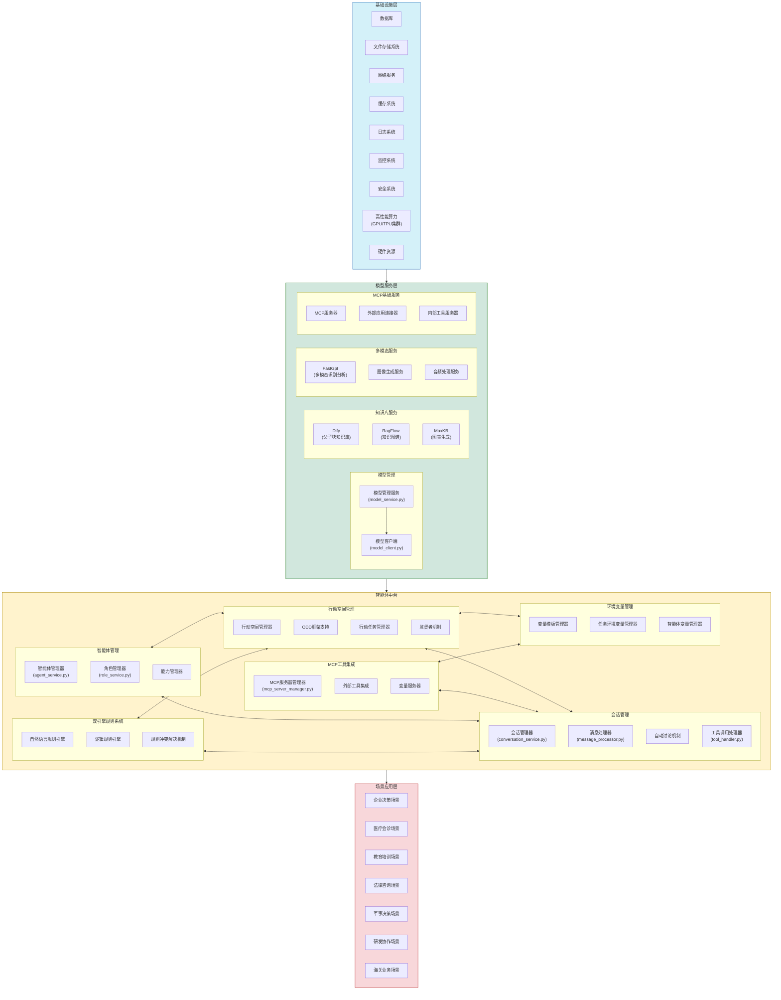
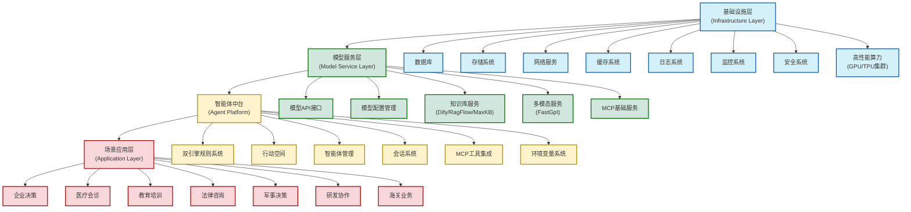

# ABM-LLM 多智能体专家决策与执行系统架构

## 系统架构图

## 系统层级结构图

## 架构说明

### 1. 场景应用层

场景应用层提供针对不同行业和场景的专业解决方案：

- **企业决策场景**：战略制定、团队协作、项目管理
- **医疗会诊场景**：多专家诊断讨论和治疗方案制定
- **教育培训场景**：模拟课堂讨论、案例分析、辩论训练
- **法律咨询场景**：法律分析、案例研究、诉讼策略
- **军事决策场景**：战术分析、情报评估、资源调配
- **研发协作场景**：产品开发、代码审查、架构设计
- **海关业务场景**：通关审核、风险评估、政策解读、跨境贸易合规分析

### 2. 智能体中台

智能体中台是系统的核心，提供智能体协作的基础设施：

#### 2.1 双引擎规则系统

- **自然语言规则引擎**：处理自然语言描述的规则
- **逻辑规则引擎**：处理编程语言定义的精确规则
- **规则冲突解决机制**：处理规则之间的冲突

#### 2.2 行动空间管理

- **行动空间管理器**：创建和管理行动空间
- **ODD框架支持**：提供标准化的行动空间描述
- **行动任务管理器**：管理具体的行动任务实例
- **监督者机制**：监控和干预智能体交互

#### 2.3 智能体管理

- **智能体管理器**：创建和管理智能体
- **角色管理器**：定义和管理专业角色
- **能力管理器**：管理智能体的能力和工具

#### 2.4 会话管理

- **会话管理器**：管理智能体之间的会话
- **消息处理器**：处理消息的格式化和转换
- **自动讨论机制**：支持智能体自主讨论
- **工具调用处理器**：处理智能体的工具调用

#### 2.5 MCP工具集成

- **MCP服务器管理器**：管理MCP服务器的生命周期
- **外部工具集成**：集成各种外部工具
- **变量服务器**：提供变量访问服务

#### 2.6 环境变量管理

- **变量模板管理器**：管理变量模板
- **任务环境变量管理器**：管理任务级公共变量
- **智能体变量管理器**：管理智能体私有变量

### 3. 模型服务层

模型服务层不仅负责与大语言模型的交互和管理，还包含构建智能体所必须的各类基础组件：

#### 3.1 模型管理

- **模型客户端**：处理与LLM API的通信
- **模型管理服务**：管理模型配置、参数和访问控制

#### 3.2 知识库服务

- **Dify**：提供父子块知识库功能，支持结构化知识管理
- **RagFlow**：提供知识图谱功能，支持复杂知识关系的表示和查询
- **MaxKB**：提供图表生成功能，将数据可视化

#### 3.3 多模态服务

- **FastGpt**：提供多模态识别分析功能，处理图像、文本等多种模态数据
- **图像生成服务**：生成各类图像内容
- **音频处理服务**：处理语音识别和合成

#### 3.4 MCP基础服务

- **MCP服务器**：提供Model-Control-Protocol标准接口，用于操作各类内外部应用
- **外部应用连接器**：连接第三方应用和服务
- **内部工具服务器**：提供系统内部工具的访问接口

### 4. 基础设施层

基础设施层提供系统运行所需的基础组件和服务：

- **数据库**：存储系统核心数据，包括智能体、角色、行动空间、规则等
- **存储系统**：存储大型文件、日志和系统资源
- **网络服务**：提供HTTP/WebSocket服务，支持前端通信
- **缓存系统**：提高系统性能，缓存常用数据
- **日志系统**：记录系统运行日志，支持问题排查和审计
- **监控系统**：监控系统运行状态，提供性能指标和告警
- **安全系统**：提供身份认证、权限控制和数据加密等安全保障
- **高性能算力**：提供GPU/TPU集群等高性能计算资源，支持大规模模型推理和训练
