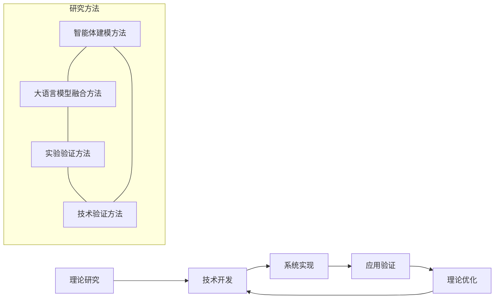
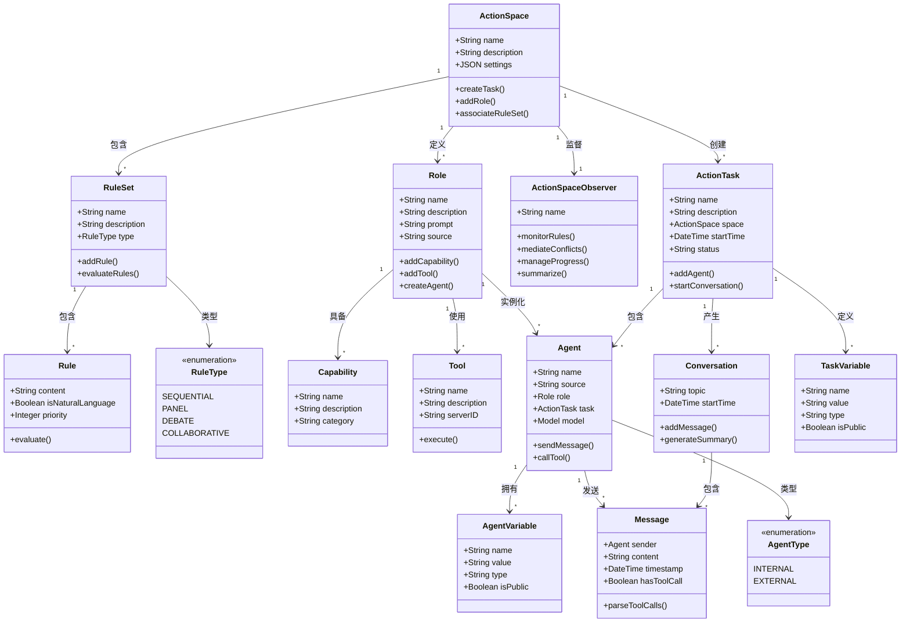
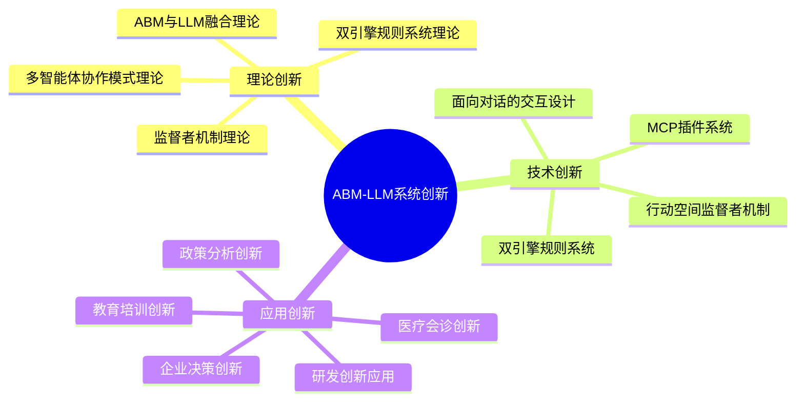
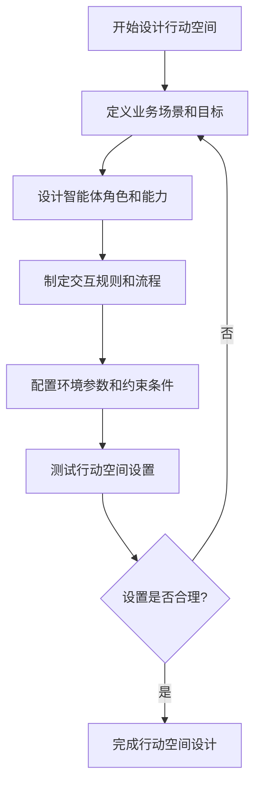
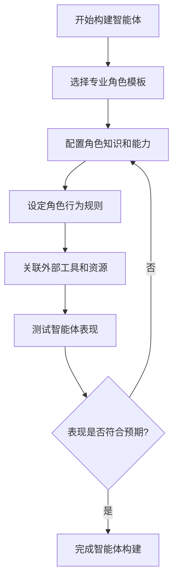
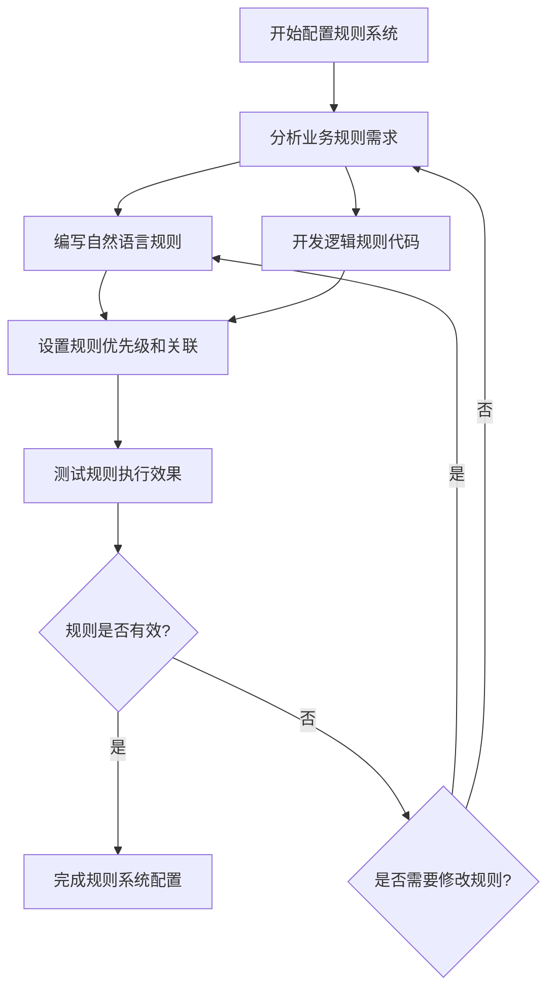
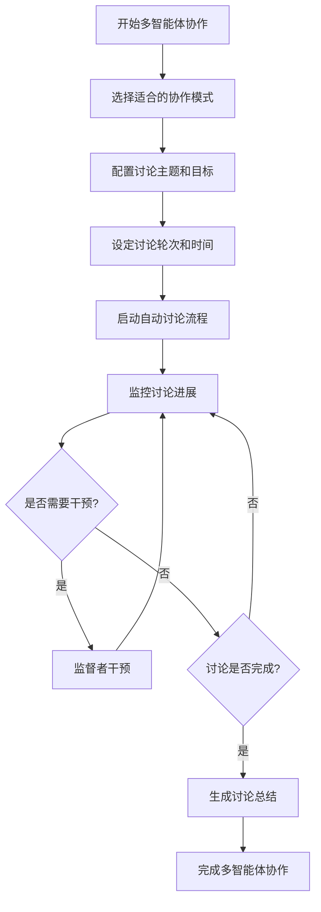
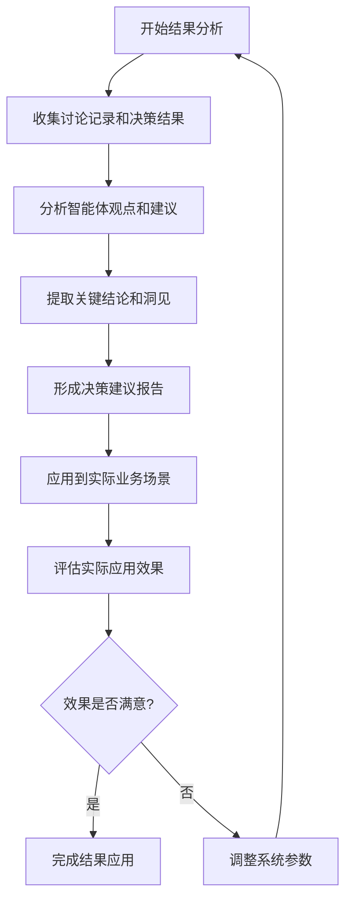

# 六、项目研究采用的研究、试验方法和技术路线（包括工艺流程）及创新之处

## （一）研究方法

本项目采用理论研究与实践验证相结合的方法，通过智能体建模与大语言模型融合的创新研究路径，构建多智能体专家决策与执行系统。



### 1. 智能体建模与大语言模型融合方法

本项目将传统智能体建模(ABM)与大语言模型(LLM)技术相结合，通过以下方法实现：

1. **智能体行为建模**：基于ODD（Overview, Design concepts, Details）框架构建智能体行为模型，定义智能体的属性、行为规则和交互机制。
2. **大语言模型能力映射**：将大语言模型的语义理解、推理和生成能力映射到智能体的认知过程中，使智能体具备自然语言理解和生成能力。
3. **双引擎规则系统设计**：结合自然语言规则和逻辑规则的双引擎架构，实现规则的灵活表达和精确执行。
4. **多智能体协作模式研究**：研究不同协作模式（顺序、小组、辩论、协作）下智能体的交互效果和决策质量。
5. **监督者机制设计**：研究监督者角色在多智能体系统中的作用和实现机制。

### 2. 实验验证方法

1. **对照实验法**：将传统ABM方法与本项目提出的ABM-LLM融合方法进行对照实验，比较在相同决策场景下的效果差异。
2. **场景模拟法**：构建多种真实业务场景（如项目管理、医疗会诊、教育培训等），测试系统在不同场景下的适应性和效果。
3. **专家评估法**：邀请相关领域专家对系统生成的决策结果进行评估，验证系统的专业性和可靠性。
4. **用户体验测试**：通过实际用户使用系统并收集反馈，评估系统的易用性和实用性。
5. **长期追踪研究**：对系统长期运行的效果进行追踪研究，评估系统的稳定性和可持续性。

### 3. 技术验证方法

1. **功能测试**：验证系统各功能模块的正确性和完整性。
2. **性能测试**：测试系统在高并发、大数据量情况下的性能表现。
3. **安全性测试**：评估系统在数据安全、隐私保护等方面的表现。
4. **集成测试**：验证系统与外部工具和系统的集成效果。
5. **回归测试**：确保新功能的添加不影响现有功能的正常运行。

## （二）技术路线

### 1. 总体技术路线

本项目技术路线遵循"理论研究→核心技术开发→系统实现→应用验证"的总体思路：

```
理论研究 → 核心技术开发 → 系统实现 → 应用验证
   ↓              ↓             ↓            ↓
智能体模型     双引擎规则系统    后端服务     企业决策场景
   +           行动空间框架      前端界面     医疗会诊场景
大语言模型     多智能体协作     数据存储系统   教育培训场景
   ↓          MCP工具集成      模型API集成    用户反馈收集
融合理论                       系统管理功能   持续优化迭代
```

### 2. 系统实体关系模型

以下mermaid图展示了系统中行动空间、角色、智能体等核心实体之间的关系：



这个实体关系模型展示了系统的核心组件及其相互关系：

- **行动空间(ActionSpace)** 是整个系统的核心概念，它定义了智能体交互的环境和规则
- **角色(Role)** 定义了专业角色的知识、能力和行为模式
- **智能体(Agent)** 是角色的具体实例，能够在行动任务中交互和协作
- **规则集(RuleSet)** 和 **规则(Rule)** 定义了智能体交互的约束条件
- **行动任务(ActionTask)** 是行动空间的具体实例，代表一次具体的多智能体协作过程
- **会话(Conversation)** 和 **消息(Message)** 记录了智能体之间的交互内容
- **能力(Capability)** 和 **工具(Tool)** 扩展了智能体的功能范围
- **变量(TaskVariable, AgentVariable)** 管理了系统中的状态和参数
- **监督者(ActionSpaceObserver)** 负责监控和干预智能体交互过程

### 3. 核心技术开发路线

#### (1) 双引擎规则系统开发路线

1. **自然语言规则引擎设计与实现**
   - 规则解析机制开发
   - 上下文匹配算法研究
   - 规则评估方法实现
   - 执行建议生成机制开发

2. **逻辑规则引擎设计与实现**
   - 代码解析器开发
   - 安全沙箱机制实现
   - 变量绑定系统开发
   - 结果验证机制实现

3. **规则冲突解决机制研究与实现**
   - 优先级机制设计
   - 规则分类系统开发
   - 上下文敏感评估算法研究
   - 监督者干预机制实现

#### (2) 行动空间与ODD框架开发路线

1. **行动空间概念实现**
   - 基本信息模型设计
   - 背景设定机制开发
   - 规则集关联系统实现
   - 角色定义机制开发
   - 环境变量系统实现

2. **ODD框架实现**
   - Overview（概述）组件开发
   - Design concepts（设计概念）组件实现
   - Details（细节）组件开发
   - JSON结构设计与存储机制实现

3. **行动空间监督者机制开发**
   - 规则执行监控系统实现
   - 冲突调解机制开发
   - 进度管理功能实现
   - 总结与引导功能开发
   - 异常处理机制实现

#### (3) 多智能体协作模式开发路线

1. **顺序模式实现**
   - 发言队列管理系统开发
   - 轮次控制机制实现
   - 发言时间限制功能开发

2. **小组模式实现**
   - 自主发言机制开发
   - 动态调整算法研究
   - 打断和回应机制实现
   - 主持人角色功能开发

3. **辩论模式实现**
   - 阵营分配机制开发
   - 辩论流程管理系统实现
   - 裁判角色功能开发
   - 辩论结果分析功能实现

4. **协作模式实现**
   - 目标和资源共享机制开发
   - 互补性贡献识别算法研究
   - 任务分解系统实现
   - 协作进度跟踪功能开发

5. **自动讨论机制实现**
   - 轮次控制系统开发
   - 主题引导机制实现
   - 上下文维护系统开发
   - 总结生成功能实现
   - 流式输出机制开发

#### (4) MCP工具集成开发路线

1. **Model-Control-Protocol实现**
   - 标准化接口设计
   - 安全沙箱机制开发
   - 双向通信系统实现
   - 多种通信方式支持开发

2. **环境变量与智能体变量管理系统实现**
   - 变量类型系统设计
   - MCP工具集开发
   - 类型转换机制实现
   - 历史记录功能开发
   - 访问控制系统实现

3. **外部工具集成架构开发**
   - 配置文件管理系统实现
   - 工具类型支持开发
   - 统一MCP接口设计
   - 标准化工具调用语法实现

4. **MCP服务器管理系统开发**
   - 配置管理功能实现
   - 生命周期管理系统开发
   - 状态监控功能实现
   - 错误处理机制开发
   - 自动清理功能实现

### 4. 系统实现路线

- **后端服务**：基于Python + Flask开发后端服务，实现核心业务逻辑和API接口。
- **前端界面**：使用React + Ant Design构建用户界面，提供直观的交互体验。
- **数据存储**：设计关系型数据库结构，存储智能体、规则、行动空间等核心数据。
- **模型集成**：接入多种大语言模型API，支持不同能力和成本的选择。
- **系统管理**：实现用户管理、权限控制、日志记录和系统监控功能。

## （三）创新之处



### 1. 理论创新

- **ABM与LLM融合理论**：首次系统性提出智能体建模与大语言模型融合的理论框架，为智能体系统赋予自然语言理解和生成能力。该理论突破了传统ABM系统中智能体交互方式的局限，使智能体能够通过自然语言进行复杂的语义交互。

- **双引擎规则系统理论**：创新性提出自然语言规则与逻辑规则并行的双引擎规则系统理论，解决规则表达灵活性与执行精确性的矛盾。该理论实现了语义理解与逻辑计算的有机结合，大大扩展了规则系统的表达能力和应用范围。

- **多智能体协作模式理论**：系统研究基于对话的多智能体协作模式，提出顺序、小组、辩论、协作四种基本协作模式的理论模型。该理论为不同业务场景下的多智能体协作提供了理论指导，使系统能够适应各种复杂的协作需求。

- **监督者机制理论**：提出多智能体系统中监督者角色的理论模型，为智能体系统的可控性和安全性提供理论基础。该理论解决了多智能体系统中的监控和干预问题，确保系统运行符合预期目标和约束条件。

### 2. 技术创新

- **双引擎规则系统**：结合自然语言规则引擎和逻辑规则引擎，实现规则表达的灵活性与执行的精确性完美结合。该技术创新使系统能够同时处理"产品质量不满足要求时应该如何处理"等语义规则和"if (risk_score > 0.7) then reject_proposal()"等逻辑规则，大大提高了规则系统的适用性。

- **行动空间监督者机制**：引入监督者角色，实时监控智能体行为和规则执行，确保模拟过程符合预设条件。该技术创新实现了对智能体交互过程的动态监控和干预，提高了系统的可控性和安全性，特别适用于需要严格控制的业务场景。

- **面向对话的交互设计**：基于自然语言对话的智能体交互模式，支持多种对话模式，使智能体互动更加自然高效。该技术创新使智能体之间的交互更接近人类专家之间的自然对话，提高了交互的效率和质量，使系统生成的结果更具可解释性。

- **MCP插件系统**：通过Model-Control-Protocol标准，实现智能体与外部系统和工具的无缝交互，将决策转化为执行指令。该技术创新打破了智能体系统与外部世界的隔阂，使智能体能够调用外部工具、访问外部数据和控制外部系统，大大扩展了系统的应用范围。

### 3. 应用创新

- **企业决策创新**：将多智能体系统应用于企业决策领域，提供全新决策支持方式，模拟多方观点，提高决策质量。在战略规划、投资决策、风险评估等场景中，系统能够模拟不同部门和角色的观点，提供全面的决策参考，避免决策偏差。

- **医疗会诊创新**：在医疗会诊领域应用多智能体系统，实现多专家协作诊断模拟，为医疗决策提供辅助工具。系统可以模拟不同专科医生的诊断思路和建议，综合多方意见，辅助医生做出更全面的诊疗决策。

- **教育培训创新**：将多智能体系统应用于教育培训领域，提供新型教学辅助工具，模拟各种教学场景和讨论过程。系统可以模拟教师、学生和专家的角色，创建互动式学习环境，提高教学效果和学习体验。

- **政策分析创新**：在政策分析领域应用多智能体系统，模拟政策实施的多方影响，为政策制定提供参考。系统可以模拟不同利益相关者的反应和行为，评估政策的潜在影响和效果，辅助政策制定者做出更科学的决策。

- **研发创新应用**：将多智能体系统应用于研发创新领域，提供创意碰撞和方案评估工具，促进创新思维发展。系统可以模拟不同专业背景的研发人员，进行创意头脑风暴和方案评估，激发创新思维，提高研发效率。

## （四）工艺流程

本项目的工艺流程主要包括以下几个环节：

### 1. 行动空间设计流程



行动空间设计是整个系统的基础，它定义了智能体交互的环境和规则。设计过程包括：

- **定义业务场景和目标**：明确行动空间要解决的具体业务问题和预期目标
- **设计智能体角色和能力**：根据业务场景需求，设计所需的专业角色及其核心能力
- **制定交互规则和流程**：设计智能体之间的交互规则、讨论流程和决策机制
- **配置环境参数和约束条件**：设置影响决策的关键参数和约束条件
- **测试和优化**：通过模拟测试验证行动空间设计的合理性，并进行必要的调整

### 2. 智能体构建流程



智能体构建是实现专业角色的关键环节，包括：

- **选择专业角色模板**：从预设的角色模板库中选择适合的专业角色
- **配置角色知识和能力**：为角色配置专业知识、技能和经验
- **设定角色行为规则**：定义角色的行为模式、决策偏好和交互风格
- **关联外部工具和资源**：为角色配置可使用的外部工具和资源
- **测试和优化**：通过模拟对话测试角色表现，并进行必要的调整

### 3. 规则系统配置流程



规则系统配置是确保智能体行为符合业务要求的关键环节，包括：

- **分析业务规则需求**：明确业务场景中的规则需求和约束条件
- **编写自然语言规则**：使用自然语言描述复杂的业务规则和模糊条件
- **开发逻辑规则代码**：使用JavaScript或Python编写精确的计算逻辑和确定性规则
- **设置规则优先级和关联**：定义规则之间的优先级和关联关系
- **测试和优化**：验证规则在各种情况下的执行效果，并进行必要的调整

### 4. 多智能体协作流程



多智能体协作是系统的核心运行环节，包括：

- **选择适合的协作模式**：根据业务需求选择顺序、小组、辩论或协作模式
- **配置讨论主题和目标**：明确讨论的核心主题和预期目标
- **设定讨论轮次和时间**：设置讨论的轮次和时间限制
- **启动自动讨论流程**：启动智能体之间的自动讨论
- **监控和干预**：通过监督者角色监控讨论进展，必要时进行干预
- **总结和评估**：生成讨论总结，评估讨论结果

### 5. 结果分析与应用流程



结果分析与应用是将系统输出转化为实际价值的关键环节，包括：

- **收集讨论记录和决策结果**：整理智能体讨论的完整记录和决策结果
- **分析智能体观点和建议**：分析不同智能体提出的观点和建议
- **提取关键结论和洞见**：从讨论中提取关键结论和有价值的洞见
- **形成决策建议报告**：将分析结果整理为决策建议报告
- **应用到实际业务场景**：将决策建议应用到实际业务场景中
- **评估和优化**：评估应用效果，必要时调整系统参数并重新运行

通过这一系列工艺流程，本项目能够有效支持复杂决策场景下的多方协作，提高决策质量和效率，为各行业提供创新的智能决策支持工具。
