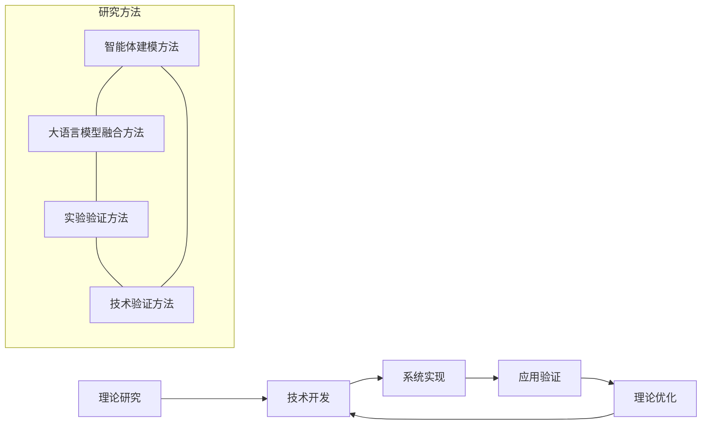

# 六、项目研究采用的研究、试验方法和技术路线（包括工艺流程）及创新之处

## （一）研究方法

本项目采用理论研究与实践验证相结合的方法，通过智能体建模与大语言模型融合的创新研究路径，构建多智能体专家决策与执行系统。

### 1. 智能体建模与大语言模型融合方法

本项目将传统智能体建模(ABM)与大语言模型(LLM)技术相结合，通过以下方法实现：

- **基于ODD框架的智能体建模**：采用Overview, Design concepts, Details框架构建智能体行为模型，定义智能体属性、行为规则和交互机制。
- **大语言模型能力映射**：将大语言模型的语义理解、推理和生成能力映射到智能体认知过程，使智能体具备自然语言交互能力。
- **双引擎规则系统**：结合自然语言规则和逻辑规则的双引擎架构，实现规则的灵活表达和精确执行。
- **多智能体协作模式**：设计顺序、小组、辩论、协作四种基本协作模式，支持不同场景下的智能体交互。
- **监督者机制**：引入监督者角色，实时监控智能体行为和规则执行，确保模拟过程符合预设条件。

具体实现步骤包括：

1. **智能体行为建模**：基于ODD框架构建智能体行为模型，定义智能体的属性、行为规则和交互机制。
2. **大语言模型能力映射**：将大语言模型的语义理解、推理和生成能力映射到智能体的认知过程中，使智能体具备自然语言理解和生成能力。
3. **双引擎规则系统设计**：结合自然语言规则和逻辑规则的双引擎架构，实现规则的灵活表达和精确执行。
4. **多智能体协作模式研究**：研究不同协作模式（顺序、小组、辩论、协作）下智能体的交互效果和决策质量。
5. **监督者机制设计**：研究监督者角色在多智能体系统中的作用和实现机制。

### 2. 实验验证方法

- **对照实验法**：将传统ABM方法与本项目的ABM-LLM融合方法进行对照实验，比较决策效果差异。
- **场景模拟法**：构建企业决策、医疗会诊、教育培训等真实业务场景，测试系统适应性。
- **专家评估法**：邀请领域专家评估系统生成的决策结果，验证专业性和可靠性。
- **用户体验测试**：通过实际用户使用系统并收集反馈，评估易用性和实用性。
- **长期追踪研究**：对系统长期运行效果进行追踪，评估稳定性和可持续性。

### 3. 技术验证方法

- **功能测试**：验证系统各功能模块的正确性和完整性。
- **性能测试**：测试系统在高并发、大数据量情况下的性能表现。
- **安全性测试**：评估系统在数据安全、隐私保护等方面的表现。
- **集成测试**：验证系统与外部工具和系统的集成效果。
- **回归测试**：确保新功能的添加不影响现有功能的正常运行。
